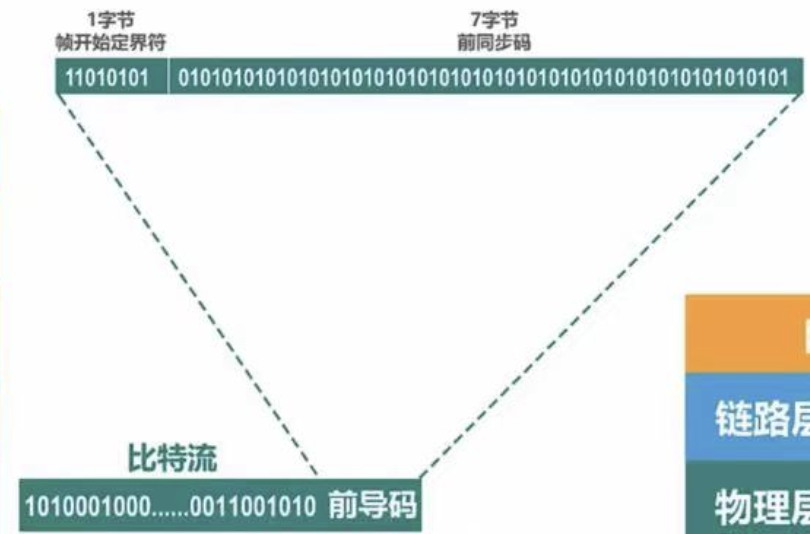

# 第一章 计算机网络体系结构
## 网络、互联网和因特网
### 网络：由若干结点和连接这些结点的链路构成
### 互联网internet（小写，通用名词）：多个网络还可以通过路由器互连在一起，这样构成了一个覆盖范围更大的网络
### 因特网Internet（大写，专用名词）：指目前全球最大的、开放的、由众多网络互连而成的特定计算机网络，采用TCP/IP协议簇作为通信规则
## 因特网的组成
###

- 边缘部分：由所有连接在因特网上的主机组成（路由器是专用计算机，但不称为主机）。这部分是用户直接使用的，用来进行通信（传送数据、音频或视频）和资源共享
- 核心部分：由大量网络和连接这些网络的路由器组成。这部分是为边缘部分提供服务（提供连通性和交换）
### 组成部分
- 硬件、软件、协议
### 功能组成
- 通信子网：由各种传输介质、通信设备和相应的网络协议组成，使网络具有数据传输、交换、控制和存储能力，实现联网计算机之间的数据通信
- 资源子网
	- 实现资源共享功能以及软件的集合，向网络用户提供共享其他计算机硬件、软件和数据的服务
## 三种交换方式（王道第二章）
###

- 电路交换
	- 数据传输前，先建立起一条专用的物理通信路径，这一路径在整个数据传输期间一直被独占，知道通信结束才释放（连接建立、数据传输、连接释放）
- 分组交换
	- 产生原因：电路交换可以实现计算机间的数据交换，但线路传输效率很低，计算机数据是突发式的出现在传输线路上的
	- 数据交换的单位是报文，报文携带有目的地址、源地址等信息。报文交换在交换结点的时候采用的是存储转发方式
- 报文交换
	- 采用存储转发方式，限制每次传送数据块大小，大数据块划分为小数据块，加上必要控制信息（源地址、目的地址、编号信息），构成分组。网络结点根据控制信息把分组送到下一结点（保存并排队），直到目的地
	- 数据报：存储转发方式
	- 虚电路：分组发送前，发送方和接收方建立一条逻辑上的虚电路，连接一旦建立就固定了虚电路对应的物理路径
	- 比较
			- 数据报服务
				- 虚电路服务
		- 连接的建立
			- 不需要
				- 必须有
		- 目的地址
			- 每个分组都有完整的目的地址
				- 仅在建立连接阶段使用，之后每个分组使用长度较短的虚电路号
		- 路由选择
			- 每个分组独立地进行路由选择和转发
				- 属于同一条虚电路的分组按照同一路由转发
		- 分组顺序
			- 不保证分组的有序到达
				- 保证分组的有序到达
		- 可靠性
			- 不保证可靠通信，可靠性由用户主机来保证
				- 可靠性由网络保证
		- 对网络故障的适应性
			- 出故障结点丢失分组，其他分组正常传输
				- 所有经过故障结点的虚电路均不能正常工作
		- 差错处理和流量控制
			- 由用户主机进行流量控制，不保证数据报的可靠性
				- 可由分组交换网负责，也可由用户主机负责
## 计算机网络的定义（精确定义未统一）
### 最简单定义：一些互相连接的、自治的计算机的集合
- 互连：是指计算机之间可以通过有线或无线的方式进行数据通信
- 自治：是指独立的计算机，它有自己的硬件和软件，可以单独运行使用
- 集合：是指至少需要两台计算机
### 较好定义：计算机网络主要是由一些通用的、可编程的硬件互连而成的，而这些硬件并非专门用来实现某一特定目的（传送数据或视频信号）。这些可编程的硬件能够用来传送多种不同类型的数据，并能支持广泛的和日益增长的应用
- 读一遍意思意思算了
## 计算机网络的分类
### 按覆盖范围分类
- 广域网WAN
	- 长距离通信，几十米到几千千米，覆盖国家、地区
	- 因特网的核心部分，其任务是为核心路由器提供远距离高速连接，互连分布在不同区域的城域网和局域网
- 城域网MAN
	- 覆盖一个城市，五到五十公里
	- 通常作为城市骨干网，互连大量企业、机构和校园局域网
- 局域网LAN
	- 一般用微型计算机或工作站通过高速通信线路相连，范围在一公里左右，通常由某单位拥有、使用和维护
- 个域网PAN
	- 在个人工作地方把属于个人的电子设备（笔记本、打印机、鼠标、耳机等），用无线技术连接起来的网络，大约覆盖十米
### 按使用者分类
- 公用网
	- 电信公司出资建造的网络，交钱能用
- 专用网
	- 某个部门为特殊业务需要而建造的网络（军队、铁路、电力系统等）
### 传输技术分类
- 广播式网络（局域网）
	- 所有联网计算机共享一个公共通信信道
- 点对点网络（广域网）
	- 每个物理线路连接一对计算机
### 按拓扑结构分类
-  
	- 总线型网络
	- 星型网络
	- 环形网络
	- 网状型网络
### 按交换技术分类
- 电路交换网络
- 报文交换网络
- 分组交换网络
### 按传输介质分类
- 有线网络
- 无线网络
## 计算机网络的性能指标
### 速率
- 比特（常用数据量单位）：8bit = 1Byte，KB = 2^10B，MB = 2^20B，GM = 2^30B，TB = 2^40B
- 速率（常用数据率单位）：bit/s (bps)，kb/s=10^3b/s，Mb/s=10^6b/s，Gb/s=10^9b/s，Tb/s=10^12b/s
### 带宽
- 带宽在模拟信号系统中的意义
	- 信号所包括的各种不同频率成分所占据的频率范围（Hz，kHz，MHz，GHz）
- 带宽在计算机网络中的意义
	- 通信线路所能传送数据的能力，单位时间从网络一点到另一点所能通过的“最高数据率”（b/s，kb/s...）
### 吞吐量
- 单位时间内通过某个网络（信道、接口）的数据量，经常被用于对网络的测量，受网络的带宽和额定速率的限制
### 时延
- 数据从网络的一端传送到另一端所需要的时间
- 发送时延
	- 分组的所有bit推向传输链路所需的时间
		- 发送时延 = 分组长度(b) / 发送速率(b/s)
- 传播时延
	- 一个bit从链路一端到另一端的时间
		- 传播时延 = 信道长度(m) / 电磁波传播速率(m/s)
- 处理时延
	- 数据在交换结点为存储转发而进行的一些必要处理所需时间
- 排队时延
	- 分组在进入路由器后，像排队一样等待转发的时间
### 时延带宽积
-  
	- 发送端连续发送数据且发送的第一个数据即将到达终点时，发送端已发出的比特数
	- 时延带宽积 = 传播时延 × 带宽
### 往返时间
- RTT，发送数据到接受到接收端的确认，经历的时延
### 利用率
-  
	- 信道利用率：用来表示某信道有百分之几的时间是被利用的
	- 网络利用率：全网络的信道利用率的加权平均
	- 信道利用率不是越高越好，超过50%时延急剧增大
### 丢包率
- 分组丢失率，一定时间内，传输过程中丢失分组占比（用户透明）
	- 分组传输过程中出现误码
	- 分组到达一台队列已满的分组交换机时被丢弃，通信量较大时可能造成网络拥塞
## 计算机网络体系结构
### 常见的计算机网络体系结构
-  
	- OSI体系结构：理论研究产物，研究出来时候TCP/IP体系结构已经抢占大部分市场
		- 专家缺乏实际经验，无商业驱动力
		- 实现复杂，运行效率低
		- 制定周期太长，按OSI标准生产的设备无法及时进入市场
		- 层次划分不合理
	- TCP/IP体系结构：实际使用的体系结构
	- 原理体系结构：有利于对计算机网络原理的学习，所以有了我们课本上的五层模型
### 计算机网络体系结构分层的必要性
- 复杂系统，分层设计理念（分治思想）
- 物理层问题
	- 实现两台计算机通过一条网线连接，传输信号
		- 采用怎样的传输媒体
		- 采用怎样的物理接口
		- 使用怎样的信号表示比特0和1
- 数据链路层问题
	- 链路中多个主机传输数据
		- 如何标识网络中各主机（主机编址问题，利用MAC地址）
		- 如何从信号所表示的一连串比特流中区分出地址和数据
		- 如何协调各主机争用总线（碰撞问题）
- 此时解决了物理层和数据链路层问题，可以实现分组在一个网络上传输
- 网络层
	- 因特网由网络和路由器互联起来，实现网络间数据传输
		- 如何标识各网络以及网络中的各主机（网络和主机共同编址的问题，IP地址）
		- 路由器如何转发分组，如何进行路由选择
- 传输层
	- 一个主机中有不同进程需要通信，即实现进程间通信
		- 如何解决进程之间基于网络的通信问题
		- 若出现传输错误，如何处理
			- 某个分组在传输过程中出现误码，或由于路由器繁忙而丢弃分组
- 应用层
	- 通过应用进程间的交互来完成特定的网络应用
### OSI参考模型
- 物理层
	- 解决使用何种信号来传输比特0和1的问题
		- 定义接口特性、定义传输模式（半工、半双工、全双工）、定义传输速率、比特同步（时钟）、比特编码（规定电压）
	- 传输单位：比特
	- 设备：中继器，集线器 Hub
- 数据链路层
	- 解决分组在一个网络（或一段链路）上传输的问题
		- 成帧、差错控制（帧错+位错）、流量控制、访问/接入控制（控制对信道的访问）
	- 传输单位：帧
	- 协议：PPP、ALOHA、CSMA
	- 设备：网桥，交换机 Switch
- 网络层
	- 解决分组在多个网络之间传输（路由）的问题
		- 路由选择、流量控制、拥塞控制、差错控制
	- 传输单位：数据报
	- 协议：IP、ARP、NAT、ICMP、IGMP、OSPF
	- 设备：路由器 R
- 运输层
	- 解决进程之间基于网络的通信问题
		- 端到端传输、流量控制、差错控制、分时复用
			- 分用：运输层把信息分别给应用层中相应的进程
			- 复用：多个应用层程序使用运输层服务
	- 传输单位：报文段（TCP）、用户数据报（UDP）
	- 协议：TCP、UDP
- 会话层
	- 解决进程之间进行会话问题
		- 为表示层建立连接，有序传输数据，管理会话进程；校验点/同步点恢复通信，实现数据同步
- 表示层
	- 解决通信双方交换信息的表示问题
		- 数据格式变换、数据加密解密、数据压缩和恢复
- 应用层
	- 解决通过应用进程之间的交互来实现特定网络应用的问题
	- 协议：DNS、FTP、SMTP、HTTP、DHCP、RIP、BGP
### TCP/IP模型和OSI模型
- 不同
	- OSI模型
		- TCP/IP模型
- 网络层
	- 无连接+面向连接
		- 无连接，不可靠
- 传输层
	- 面向连接
		- 无连接+面向连接
### 计算机网络体系结构通信过程（访问浏览器页面为例）
-  
	- 应用层按HTTP协议规定，构建一个HTTP请求报文，将HTTP请求报文交付给运输层处理
	- 运输层给HTTP请求报文添加一个TCP首部，成为TCP报文段，将TCP报文段交付给网络层处理
		-  
	- 网络层给TCP报文段添加一个IP首部，成为IP数据报，将IP数据报交付给数据链路层处理
		-  
	- 数据链路层给IP数据报添加一个首部和一个尾部，成为帧，数据链路层将帧交付给物理层
		-  
	- 物理层将帧看作比特流，给比特流前面添加前导码，将比特流变换成相应的信号发送给传输媒体，到达路由器
		-  
- 路由器处理过程
	-  
		-  
			- 物理层将信号变换为比特流，去掉前导码后交付给数据链路层（交付的是帧）
			- 数据链路层将帧的首部和尾部去掉，交付给网络层（交付的是IP数据报）
			- 网络层解析IP数据报首部，从中提取目的网络地址，查找自身路由表，确定转发端口以便转发
			- 网络层将IP数据报交付给数据链路层，数据链路层给IP数据报添加首部尾部，将帧交付给物理层，物理层加前导码，转换为信号发送到传输媒体，最好到达Web服务器
-  
	- 从物理层开始依次去掉首部，并交付给上层，最后将HTTP请求报文交付给应用层，应用层对HTTP报文解析，然后发回HTTP响应报文
### 计算机网络体系机构中的专用术语
-  
	- 实体：如何可发送或接收信息的硬件或软件进程（图中各层用标有字母的小方格表示实体）
	- 对等实体：收发双方相同层次中的实体
- 协议：控制两个对等实体进行逻辑通信的规则的集合
	-  
		- 语法：定义所交换信息的格式
		- 语义：定义收发双方所要完成的操作（get请求报文、post请求报文）
		- 同步：定义收发双方的时序关系（三次握手）
- 服务
	-  
		- 在协议的控制下，两个对等实体间的逻辑通信使得本层能够向上一层提供服务
		- 要实现本层协议，还需要使用下面一层所提供的服务
		- 协议是“水平的”，服务是垂直的
		- 实体看得见相邻下层所提供的服务，但并不知道服务实现的具体协议（下层协议对上层实体透明）
		- 服务原语：上层使用下层所提供的服务必须通过与下层交换一些命令，即服务原语
	-  
		- 服务访问点SAP（逻辑接口）：同一系统中相邻两层的实体交换信息的逻辑接口，用于区分不同的服务类型
			- 数据链路层的服务访问接口：帧的“类型”字段
			- 网络层的服务访问点：IP数据报首部中的“协议字段”
			- 运输层的服务访问点：“端口号”
		- 协议数据单元PDU：对等层次之间传送的数据包称为该层的协议数据单元（帧、分组、报文）
			- PDU = PCI + SDU
		- 服务数据单元SDU：同一系统内，层与层之间交换的数据包称为服务数据单元
		- 协议控制信息PCI：控制协议操作的信息
### 补充：计算时延的理解（一类极其容易考到的题目类型）
-  
## b站：分享笔记的好人儿（暂时的名字，可以b站搜索408思维导图）
湖科大课程点出了为啥课本学的模型既不是OSI模型也不是TCP/IP模型，计算时延例题讲的太好了，通信的整体过程讲的完整且清晰，听完第一章就感觉极有额外去听的价值，特别是P9 1.6.3一共7分钟
第一章其实也是一个总结，信息量很大，但完全可以学完再回过来看
今天的好消息是408全部结束了，坏消息是我的小红书被举报直接封号，这几年的朋友圈没了，之后小红书发一篇完整地就挂机着吧
B站
已经有一个学习思路也是思维导图使用指南视频
马上做一个四门大学老师课程与王道的比较
10月可能会说一下选学校的失败教训？有点主观不一定
11月会出考前过一眼的浓缩版思维导图（一张纸一本书）
考完应该会立刻做一个有意思的游戏（还没想好）
从0开始丝滑学算法的小小指南（应对上机）
总之我不会停留在考研，毕竟没有想着卖笔记盈利，只是伴随我的生活分享一些有用的东西
## 红色边框为一级知识点：熟悉
## 橙色边框为二级知识点：掌握
