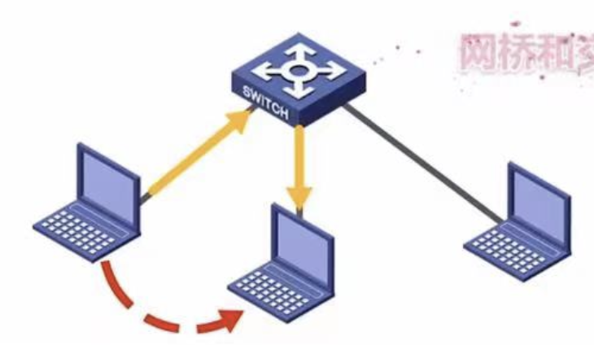

# 第三章 数据链路层
## 数据链路层概述
###

- 链路：从一个结点到相邻结点的一段物理线路，而中间没有任何其他的交换结点
- 数据链路：是指把实现通信协议的硬件和软件加到链路上，就构成了数据链路
- 数据链路层以帧为单位传输和处理数据
### 点对点信道的数据链路层（三个问题）
-  
	- 点对点信道
- 封装成帧
	- 数据链路层给网络层协议数据单元添加一个帧头（数据链路层协议首部）和帧尾的操作，称为封装成帧
- 差错检测
	- 使发送方确定接收方是否正确收到由其发送的数据的方法
		- 位错：数据中的某些位出现错误
		- 帧错：帧的丢失、重复或失序等错误
- 可靠传输
	- 尽管误码是不能完全避免的，但若能实现发送方发送什么，接收方就能收到什么，就称为可靠传输
### 广播信道的数据链路层
-  
	- 编址问题（广播信道上主机如何知道收到帧是不是自己的）
		- 将帧的目的地址、源地址添加在帧中一起传输
	- 冲突问题（总线上多台主机同时使用总线传输帧，传输信号产生碰撞）
		- 采用特殊协议（CSMA/CD等）
### 交换式局域网（使用点对点链路和链路层交换机）
-  
	- 网桥和交换机的工作原理
### 无线局域网
-  
	- CSMA/CA协议
## 封装成帧
### 封装成帧是指数据链路层给上层交付的协议数据单元添加帧头和帧尾，使之成为帧
- 帧头和帧尾中包含有重要的控制信息
	-  
		-  
- 帧头和帧尾的作用之一是帧定界
	-  
		- PPP帧格式的标志字段
	-  
		- MAC帧没有帧定界标志字段，采用前导码
### 透明传输（四种方法）
- 概念
	- 是指数据链路层对上层交付的传输数据没有任何限制，就好像数据链路层不存在一样
- 字符计数法
	-  
		- 在每个帧头部使用一个计数字段来标明帧内字符数
		- 缺点
			- 如果计数字符出错，则失去帧边界划分的依据，收发双方将失去同步而导致严重错误
- 字符填充的首尾定界符法
	-  
		- 使用一些特殊的字符来定界一帧的开始与结束flag
		- 在信息位中，在特殊字符前面要填充一个转义字符ESC，防止特殊字符被误判为帧的首尾定界符
- 零比特填充的首尾标志法
	-  
		- 使用一个特定的比特序列，即01111110来标志一帧的开始和结束
发送信息时，遇到五个连续的1就自动在后面加0；
当收到信息时，遇到5个连续的1就自动在后面减0；（可硬件实现，性能优于字符填充法）
- 违规编码法
	-  
		- 可以采用违规编码序列来界定帧的开始和结束
		- 例如曼彻斯特编码只有“高-低”、“低-高”，通过“高-高”、“低-低”界定
### 为了提高帧的传输效率，应当使帧的数据部分的长度尽可能大些
- 考虑到差错控制等多种因素，每一种数据链路层协议都规定了帧的数据部分的长度上限，即最大传送单元MTU
	-  
## 差错控制
### 概述
- 实际的通信链路都不是理想的，比特在传输过程中可能会产生差错：1可能会变成0，而0也可能变成1，这称为比特差错
- 使用差错检测码（帧格式中FCS字段）来检测数据在传输过程中是否产生了比特差错，是数据链路层所要解决的重要问题之一
### 检错编码
- 奇偶校验码
	- n-1位数据和1位校验位组成，校验位用于调节发送信息中的1的个数是偶数还是奇数
- 循环冗余码 CRC
	-  
		- 任何一个由二进制数位串组成的代码都可以与一个只含有0和1两个系数的多项式建立一一对应关系
		- 步骤
			- 收发双方约定好一个生成多项式G(x)
			- 由生成多项式最高阶r，在待发送的数据低位端加上r个0
			- 模2除：利用模2除法，用待发送的数据去除G(x)，得到的余数即为冗余码
### 纠错编码
- 海明码
	- 原理
		- 在有效信息位中加入几个校验位形成海明码，并把海明码的每个二进制位分配到几个奇偶校验组中，当某一位出错后，就会引起有关几个校验位的值发生变化，可以发现并确定错位的位置
	- 海明距离
		- 两个合法编码的对应比特取值不同的比特数称为码距，又称海明距离
一个有效编码集中，任意两个合法编码的海明距离的最小值，称为该编码集的海明距离
	- 过程
		-  
			-  
				- 设m为有效信息的位数，r为校验位的位数--->校验码一共有2^r种取值，有海明不等式：
					- 2^r >= m+r+1（若要检测两位错，则需再增加1位校验位，即r+1）
				- 确定校验位的分布
					- 规定校验位在海明位号为2^(k-1)上，其余为信息位
				- 分组形成校验关系
					- 被校验数据位的海明位号等于校验该数位的各校验位海明位号之和
				- 校验位取值
					- 校验位的值为对应组的所有位求异或
				- 海明码的校验原理
### 检验和纠错所需位数
	- 检验
		- 纠错
- 位数
	- d
		- d
- 需要的总位数
	- d+1
		- 2d+1
## 流量控制与可靠传输机制
### 基本概念
- 流量控制
	- 流量控制涉及对链路上的帧的发送速率的控制，以使接收方有足够的缓冲空间来接收每个帧（数据链路层，点到点；传输层也有流量控制，端到端）
- 可靠传输
	- 尽管误码是不能完全避免的，但若能实现发送方发送什么，接收方就能收到什么，就称为可靠传输
		- 确认机制
		- 超时重传机制
- 传输差错
	- 比特错误：使用差错检测技术，接收方的数据链路层就可检测出帧在传输过程中是否产生了误码
	- 分组丢失、分组失序和分组重复：一般不出现在数据链路层，而在上层
- 数据链路层向上层提供的服务类型
	- 不可靠传输服务
		- 仅仅丢弃有误码的帧，其它啥也不做
	- 可靠传输服务
		- 想办法实现发送端发送什么，接收端就收到什么
-  
	- 一般情况下，有线链路的误码率比较低，为了减小开销，并不要求数据链路层向上提供可靠传输服务。即使出现了误码，可靠传输的问题由其上层处理
	- 无线链路易受干扰，误码率比较高，因此要求数据链路层必须向上层提供可靠传输服务
- 滑动窗口基本概念
	- 发送（接收）方维持一组连续的允许发送（接收）的帧的序号，称为发送（接收）窗口
	- 发送方
		- 发送窗口的大小代表在还未收到对方确认信息的情况下发送方最多还可以发送多少个数据帧。只有发送方接收到确认帧后发送窗口才可能向前滑动
	- 接收方
		- 只有收到数据帧的序号落在接收窗口内，才允许将帧收下，否则丢弃
	- 帧缓冲区
		- 目的
			- 为了超时重发和判定重复帧的需要
		- 实现方式
			- 发送端在发送完数据帧时，必须在其发送缓存中保留此数据帧的副本，这样才能在出错时进行重传（只有收到确认帧ACK时，才删除副本）
### 停止-等待协议 SW
-  
	- 从滑动窗口机制的角度看，停止-等待协议相当于发送窗口和接收窗口大小均为1的滑动窗口协议
	- 超时重传
		- 接收端检测到数据分组有误码时，将其丢弃并等待发送方的超时重传
		- 重传时间一般略大于平均往返时间（平均 RTT）
	- 分组编号
		- 为了让接收方（发送方）能够判断收到的数据分组是否重复，需要给数据（ACK）分组编号。由于停-等协议特性，只需一个比特编号即可（0、1）
- 信道利用率
	-  
		- 信道利用率U = TD / (TD + RTT + TA)
### 回退N帧协议 GBN
-  
	- 发送方连续发送帧，当接收方检测出失序的信息帧后，要求发送方重发最后一个正确接收的信息帧后的所有未被确认帧
	- n比特编号，发送窗口大小：1 <= WT <= 2^n - 1
                      接收窗口大小：1
	- 累计确认
		- 连续收到好几个按序到达且无误码的数据分组后，针对最后一个数据分组发送确认分组
		- 捎带确认
			- 或者在自己有数据分组要发送时才按累计确认规则进行捎带确认
	- 缺点
		- 若信道的传输质量很差导致误码率较大时，不一定优于停止-等待协议
### 选择重传协议 SR
-  
	- 概述
		- 设法只重传出现差错的数据帧和计时器超时的数据帧
			- 每个发送缓冲区对应一个计时器，当计时器超时时，缓冲区的帧就会重传
			- 一旦接收方怀疑帧出错，就会发一个否定帧NAK给发送方，要求发送方对NAK中指定的帧进行重传
			- 接收端要设置具有相当容量的缓冲区来暂存那些未按序正确收到的帧
	- 缺点
		- 需要开辟缓存空间用来存储数据
	- n比特编号，窗口大小：WR <= 2^(n-1)
## 媒体接入控制
### 共享信道要着重考虑的一个问题就是如何协调多个发送和接收站点对一个共享传输媒体的占用，即媒体接入控制MAC
### 静态划分信道
- 预先固定分配好信道，这类方法不灵活，对于突发性数据传输信道利用率低
- 信道复用
	- 复用是通信技术中的一个重要概念，复用就是通过一条物理线路同时传输多路用户的信号
	- 当网络中传输媒体的传输容量大于多条单一信道传输的总通信量时，可利用复用技术在一条物理线路上建立多条通信信道来充分利用传输媒体的带宽
- 频分多路复用 FDM
	-  
		- 频分复用的所有用户同时占用不同的频带资源并行通信
		- 将多路基带信号调制到不同频率载波上，再叠加形成一个复合信号（相邻信道需要隔离频道，防止干扰）
- 时分多路复用 TDM
	-  
		- 时分复用的所有用户在不同的时间占用同样的频带宽度
		- 是将一条物理信道按时间分成若干时间片，轮流地分配给多个信号使用
		- 统计时分多路复用 STDM（优化）
			- STDM帧不固定分配时隙，而按需动态分配时隙
- 波分多路复用 WDM
	-  
		- 在一根光纤中传输多种不同波长（频率）的光信号，由于波长（频率）不同，各路光信号互不干扰，最后再用波长分解复用器将各路波长分解出来
- 码分多路复用 CDM
	- 该技术主要用于多址接入，人们更常用的名词是码分多址CDMA
	- 特点
		- CDM的每一个用户可以在同样的时间使用同样的频带进行通信
		- 由于各用户使用经过特殊挑选的不同码型，因此各用户之间不会造成干扰
	- 过程
		-  
			- 在CDMA中，每个比特时间再划分为m个短的间隙，称为码片
			- 每一个站被指派一个唯一的m bit码片序列（原则：码片必须各不相同，互相正交）
				- 如果一个站要发送比特1，则发送它自己的m bit码片序列
				- 如果一个站要发送比特0，则发送它自己的m bit码片序列的二进制反码
### 动态划分信道
- 随机接入
	- 概念
		- 不采用集中控制方法解决发送信息的次序问题，所有用户能根据自己的意愿随机地发送信息，占用信道全部速率
		-  
	- ALOHA协议（不听就说）
		- 纯ALOHA协议
			- 当网络中的任何一个站点需要发送数据时，可以不进行任何检测就发送数据
			- 在一段时间内未收到确认，那么该站点就认为传输过程中发生了冲突
			- 发送站点需要等待一段时间后再发送数据，直至发送成功
		- 时隙ALOHA协议
			- 所有站在时间上同步起来，将时间划分为一段段等长的时隙，规定只能在每个时隙开始时才能发送一个帧
	- CSMA协议（先听再说）
		-  
			- 1-坚持CSMA协议
				- 一个结点要发送数据时，首先侦听信道
					- 如果信道空闲，那么立即发送数据
					- 如果信道忙，那么等待，同时继续侦听直至信道空闲
					- 如果发生冲突，那么随机等待一段时间后，再重新开始侦听信道
			- 非坚持CSMA协议
				- 一个结点要发送数据时，首先侦听信道
					- 如果信道空闲，那么立即发送数据
					- 如果信道忙，那么放弃侦听，等待一个随机的时间后再重复该过程
			- p-坚持CSMA协议
				- 一个结点要发送数据时，首先侦听信道
					- 如果信道忙，就持续侦听，直至信道空闲
					- 如果信道空闲，那么以概率p发送数据，以1-p概率推迟到下一个时隙（依次循环）
	- CSMA/CD协议（先听再说，边听边说）
		- 发送前先侦听，每个站在发送数据前先要检验下总线上是否有其他站点正在发送数据
			- 若有则暂时不发送数据，等到信道变空闲再发送
			- 发送时，边发送变侦听，以便判断自己再发送数据时其他站点是否也在发送数据
		- 基本概念
			- 碰撞检测
				-  
			- 争用期（碰撞窗口/以太网的端到端往返传播时延/2τ）
				- 主机最多经过2τ（即δ->0）的时长就可检测到本次发送是否遭受了碰撞
			- 为了确保发送站在发送数据的同时能检测到可能发生的冲突，帧长需要满足：最小帧长 = 总传播时延 * 数据传输率 * 2（以太网规定最小64字节）
				- 如果在争用期没有检测到碰撞，那么后续发送的数据就一定不会发生碰撞
				- 如果在争用期内检测碰撞，就立即中止发送，这时已经发送出去的数据一定小于64字节，因此凡长度小于64字节的帧都是由于碰撞而异常中止的无效帧
		- 截断二进制指数退避算法
			-  
				- 参数k，等于重传次数
				- 确定基本退避时间，一般取争用期时间
				- 当重传超过16次仍不成功时，说明网络拥挤报错
		- 适用于有线连接的局域网
	- CSMA/CA协议
		- 把碰撞检测改为碰撞避免，“碰撞避免”指协议的设计要尽量降低碰撞发送的概率
		- 碰撞避免
			-  
				- 信道预约
					- 发送方在发送数据的同时向其他站点通知自己传输数据要的时间长度，让其他站点在这段时间内不发送数据，避免碰撞
				- RTS/CTS帧
					- 可选的碰撞避免机制，解决隐蔽站问题
						- 除源站和目的站以外的其他各站，在收到CTS帧（或数据帧）后推迟接入到无线局域网中，保证通信不会受其他站干扰
					- 由于RTS帧和CTS帧很短，发送碰撞的概率、碰撞产生的开销及本身的开销都很小
					- 隐蔽站问题
						-  
							- A在给B发送数据帧前，可以使用RTS帧来预约信道，尽管C收不到RTS帧，但是C可以收到B发送给A的CTS帧，解决隐蔽站问题
				- ACK帧
					- 所有站点在正确接收到发给自己的数据帧（除广播帧和组播帧），都需要向发送方发回一个ACK帧
				- 帧间间隔IFS
					- 所有的站点必须在持续检测到信道空闲一段指定时间后才能发送帧，该时间称为帧间间隔IFS
					- 帧间间隔的长短取决于该站点要发送的帧的类型
						- 高优先级帧需要等待的时间短，可获得优先发送权
					- 短帧间间隔 SIFS
						- 最短的帧间间隔，用来分隔开属于一次对话的各帧。一个站点应当能够在这段时间内从发送方式切换到接收方式
							- ACK帧、CTS帧、由过长的MAC帧分片后的数据帧、以及所有回答AP探询的帧和在PCF方式中接入点AP发送的任何帧
					- DCF帧间间隔DIFS
						- 在DCF方式中用来发送数据帧和管理帧（用于异步竞争访问的时延）
			- 退避算法
				- 信道由忙转为空闲且经过DIFS时间后，还需要退避一段随机时间才能使用信道
				-  
					- 使用退避算法
						- 在发送数据帧之前检测到信道处于忙状态时
						- 在每一次重传一个数据帧时
						- 在每一次成功发送后要连续发送下一个帧时（避免站点长时间占用信道）
					- 当退避计时器时间减少到0时，就开始发送数据
					- 当退避计时器的时间还未减小到0时而信道又转变为忙状态，这时就冻结退避计时器的数值，重新等待信道变为空闲，再经过DIFS后，继续启动退避计时器
					- 第i次退避，退避时间在{0, 1, ... , 2^(2+i)-1}中随机选择一个，然后乘以基本退避时间（一个时隙的长度），当时隙编号到255时（第六次退避）不再增加
		- 适用于无线局域网
- 受控接入（已淘汰）
	- 集中控制
		- 有一个主站以循环方式轮询每个站点有无数据发送，只有被轮询到的站点才能发送数据，最大缺点是存在单点故障问题
		- 轮询访问：令牌传递协议
			- 通过一个集中控制的监控站，以循环方式轮询每个结点，再决定信道的分配，令牌在固定次序中转圈，拿到令牌就可以发送数据
			- 适合于负载很高的广播信道
	- 分散控制
		- 各站点是平等的，并连接成一个环形网络。令牌（一个特殊控制帧）沿环逐站传递，接收到令牌的站点才有权发送数据，并在发送完数据后将令牌传递给下一个站点
## 局域网
### 基本概念
- 概念
	- 在一个较小的地理范围内，将各种计算机、外部设备和数据库系统等通过双绞线、同轴电缆等连接介质互相连接在一起，组成资源和信息共享的计算机互联网络
- 局域网的特性决定要素
	- 拓扑结构
		- 星形结构、环形结构、总线形结构
			- 令牌环：逻辑拓扑是环形结构，物理拓扑是星形结构
			- 光纤分布数字接口 FDDI：逻辑拓扑是环形结构，物理拓扑是双环结构
	- 传输介质
		- 双绞线（主流）、铜缆和光纤
	- 介质访问控制方式
		- 总线形局域网
			- CSMA/CD、令牌总线
		- 环形局域网
			- 令牌环
- 逻辑链路控制（LLC）子层
	- 向网络层提供无确认无连接、面向连接、带确认无连接、高速传送4种不同的连接服务类型
- 媒体接入控制（MAC）子层
	- 向上层屏蔽对物理层访问的各种差异，提供对物理层的统一访问接口，主要功能包括：组帧和拆卸帧、比特传输差错控制、透明传输
### 以太网与IEEE 802.3
- 概述
	- 无连接，不可靠（无编号、不确认）
		- 尽最大努力交付，差错纠正由高层完成
	- 拓扑结构
		- 逻辑拓扑是总线形结构，物理拓扑是星形或拓展星形结构
	- 使用CSMA/CD方式对总线进行访问控制
- 以太网的传输介质与网卡
	- 传输介质的适用情况
		-  
			- 10BASE-T
				- BASE：基带信号，T：非屏蔽双绞线
				- 曼彻斯特编码
				- 物理星形，逻辑总线形
				- CSMA/CD
	- 介质访问控制（MAC）地址
		- MAC地址是对网络上各接口的唯一标识，而不是对网络上各设备的唯一标识
		- MAC地址的第二个字节的最后一位：0表示单播，1表示多播
		- 网卡在出厂时都有一个唯一的代码，用于控制主机在网络上的数据通信
	- 网卡
		- 局域网中连接计算机和传输介质的接口
		- 功能
			- 实现与局域网传输介质之间的物理连接和电信号匹配（MAC地址）
			- 实现帧的发送与接收、帧的封装与拆封、介质访问控制、数据的编码与解码及数据缓存功能
- 以太网的MAC帧
	- 网卡从网络上每收到一个MAC帧，首先要用硬件检查MAC帧中的MAC地址。如果是发往本站的帧，则收下，否则丢弃
	-  
		- 前导码：使接收端与发送端时钟同步（MAC帧与PPP帧不同，没有帧界定符，用前导码同步）
		- 目的/源地址：通常使用6字节（48bit）地址
		- 类型：2字节，指出数据域中携带的数据应交给哪个协议实体处理
		- 数据：46-1500字节，包括高层的协议信息。由于CSMA/CD算法的限制，以太网帧必须满足最小长度要求64字节，数据较少时必须加以填充（0-46字节）
		- 填充：0-46字节，当帧长太短时（<64字节）填充帧
		- 校验码FCS：采用CRC循环冗余码
- 高速以太网
	- 100BASE-T以太网
		- 在双绞线上传送100Mb/s基带信号的星形拓扑结构以太网
		- 使用CSMA/CD（支持全双工方式、半双工方式）
	- 吉比特以太网
		- 光纤/双绞线，1Gb/s
		- 用全双工和半双工（半双工用CSMA/CD）两种方式工作
	- 10吉比特以太网
		- 光纤，10Gb/s
		- 只能全双工方式，不使用CSMA/CD
- IEEE 802.11 无线局域网 
	- 无线局域网的组成
		- 有固定基础设施无线局域网
			-  
				- 802.11标准规定无线局域网的最小构件是基本服务集 BSS
				- 组成：一个基本服务集包括一个基站和若干移动站
				- 所有的站在本BSS中都可以直接通信，但在与本BSS外的站通信都需要本BSS的基站
		- 无固定基础设施无线局域网自组织网络
			-  
				- 由一些平等状态移动站相互通信组成的临时网络（各结点之间地位平等，中间结点都为转发结点，具有路由器的功能）
				- 移动自组织网络把移动性扩展到无线领域中的自治系统，具有自己特定的路由选择协议，并且可以不和因特网相连
	- MAC帧
		-  
		-  
### 虚拟局域网 VLAN
- VLAN概述
	- 一个或多个以太网交换机互连起来的交换式以太网，其所有站点都在同一个广播域
	- 巨大的广播域会带来弊端
		- 广播风暴（会浪费网络资源和各主机的CPU资源）
		- 难以管理和维护
		- 潜在的安全问题
	- 网络上会频繁出现广播信息（TCP/IP协议栈很多协议会用到，例如ARP、RIP、DHCP等）
	- 分隔广域网方法：路由器（成本高），虚拟局域网VLAN技术应运而生
	- 虚拟局域网VLAN是一种将局域网内的设备划分成与物理位置无关的逻辑组的技术，逻辑组具有某些共同需求
- IEEE 802.1Q帧
	-  
		- VLAN标记的最后12比特称为VLAN标识符VID，它唯一标志了以太网帧属于哪一个VLAN
		- 802.1Q帧是由交换机来处理的，而不是用户主机来处理的
			- 当交换机收到普通的以太网帧时，会将其插入4字节的VLAN标记转变为802.1Q帧，简称“打标签”
			- 当交换机转发802.1Q帧，可能会删除其4字节VLAN标记转变为普通以太网帧，简称“去标签”
- 交换机的端口类型
	- Access
		-  
	- Trunk
		-  
	- Hybrid
		-  
	- 检验一下会没会
		-  
## 广域网
### 概念
- 通常是覆盖范围很广的长距离网络。广域网的通信子网主要使用分组交换技术，由结点交换机以及连接这些交换机的链路组成
### PPP协议
- 使用串行线路通信的面向字节的协议，该协议应用在直接连接两个结点的链路上用来通过拨号或专线方式建立点对点连接发送数据
-  
	- 组成
		- 对各种协议数据报的封装方法（封装成帧）
		- 链路控制协议 LCP
			- 用于建立、配置以及测试数据链路的连接（物理）
		- 一套网络控制协议NCPs
			- 其中的每一个协议支持不同的网络层协议（逻辑）
	- 帧格式
		-  
- 特点
	- PPP提供差错检测但不提供纠错功能，只保证无差错接收（CRC校验），它是不可靠的传输协议，因此不使用序号和确认机制
	- 透明传输（面向字节）
		- 异步线路：字节填充
		- 同步线路：比特填充（硬件）
	- PPP两端可以运行不同的网络层协议（仅支持全双工链路，仅支持点对点链路，不支持多点线路）
	- 封装成帧：帧定界符                         MTU：不超过1500字节
### 广域网与局域网对比
-  
## 数据链路层设备
### 集线器与交换机的区别
-  
	-  
		- 使用交换机作为互联设备的以太网，称为交换式以太网。交换机可以根据MAC地址过滤帧，即隔离碰撞域
		- 交换机的每个接口是一个独立的碰撞域
		- 交换机隔离碰撞域但不隔离广播域（VLAN除外）
### 以太网交换机
- 概念
	- 局域网交换机（以太网交换机），从本质上说，以太网交换机是一个多端口的网桥，能经济地将网络分成小的冲突域，为每个工作站提供更高的带宽
- 原理
	- 检测从以太端口来的数据帧的源和目的地的MAC地址，然后与系统内部的动态查找吧进行比较
	- 若数据帧的MAC地址不在查找表中，则将该地址加入查找表，并将数据帧发送给相应的目的端口
- 特点
	- 全双工方式
	- 以太网交换机能同时连通多对端口，使每对互相连通的主机都能像独占通信媒体那样，无碰撞地传输数据
	- 即插即用设备，转发表通过自学习算法逐渐建立的
	- 使用了专用的交换结构芯片，因此交换速率较高
	- 独占传输媒体的带宽
- 两种交换模式
	- 直通式交换机（仅查目的地址6B就转发）
		- 只检查帧的目的地址，数据帧可以马上就被传输出去
		- 缺乏智能性和安全性，也无法支持具有不同速率的端口的交换
	- 存储转发式交换机
		- 先将接收到的帧缓存，然后并检查数据是否正确
			- 正确就发送出去
			- 发现帧有错，那么就将其丢弃
		- 可靠性高，能支持不同速率端口之间的转换，但延迟大
### 以太网交换机的自学习功能
- 交换机的过滤和转发借助于交换表完成
	- 决定一个帧是应该转发到某个端口还是应该将其丢弃称为过滤
	- 决定一个帧应该被移动到哪个接口称为转发
-  
## b站：分享笔记的好人儿（暂时的名字，可以b站搜索408思维导图）
真的多！！！！！！！！人没了
前半主要以湖科大老师来，局域网广域网部分按王道来，VLAN那块具体咋打标签、去标签王道没咋讲去年，可以看看湖科大的部分
关于CSMA/CA湖科大的老师讲的比较多一些，王道以前没有这部分内容，但二几年的真题考到一道IPS的题，发现现在有了
## 红色边框为一级知识点：熟悉
## 橙色边框为二级知识点：掌握
## 属于新考点，所以标红
