# 第二章 物理层
## 物理层的基本概念
###
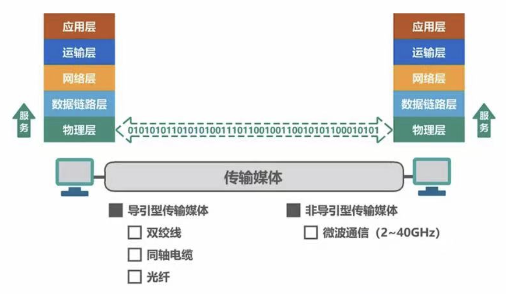
- 物理层要解决的问题
	- 物理层考虑的是怎样才能在连接各种计算机的传输媒体上传输数据比特流
	- 物理层为数据链路层屏蔽了各种传输媒体的差异，使数据链路层只需要考虑如何完成本层的协议和服务，而不必考虑网络具体的传输媒体是什么
- 物理层协议的主要任务
	- 机器特性
		- 指明借口所用的接线器的形状和尺寸、引脚数目和排序、固定和锁定装置
	- 电气特性
		- 指明在接口电缆的各条线上出现的电压的范围
	- 功能特性
		- 指明某条线上出现的某一电平的电压表示何种意义
	- 过程特性
		- 指明对于不同功能的各种可能事件的出现顺序
## 传输媒体
### 导引型传输媒体
- 同轴电缆
	-  
		- 分类
			- 基带同轴电缆（50 Ω）
				- 数字传输，过去用于局域网
			- 宽带同轴电缆（75 Ω）
				- 模拟传输，目前用于有线电视
		- 价格贵且布线不灵活，由双绞线代替
- 双绞线
	- 绞合的作用
		- 抵御部分来自外界的电磁波干扰
		- 较少相邻导线的电磁干扰
	- 分类
		- 无屏蔽双绞线 UTP
			-  
		- 屏蔽双绞线 STP
			-  
	- 使用范围（几千米到数十千米）
		- 局域网、传统电话网（数字、模拟传输）
- 光纤
	- 分类
		- 多模光纤
			-  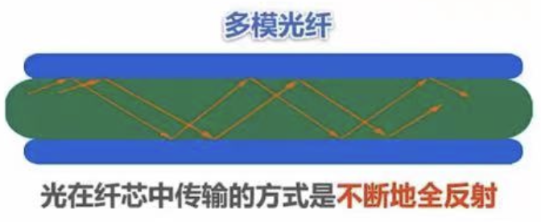
				- 近距离传输
		- 单模光纤
			-  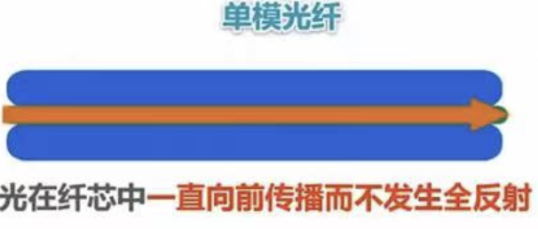
				- 长距离传输、衰减小，但成本高、光源要求高
	- 优点
		- 通信容量大（25000-30000GHz带宽），传输损耗小，远距离传输更加经济
		- 抗雷电和电磁干扰性能好，无串音干扰，不易窃听
		- 体积小、重量轻
### 非导引型传输媒体
- 无线电波（各个方向）
	- 无线电波具有较强的穿透能力，可以传输很长的距离，所以它被广泛应用于通信领域
- 微波（直线）
	- 地面微波接力通信
		-  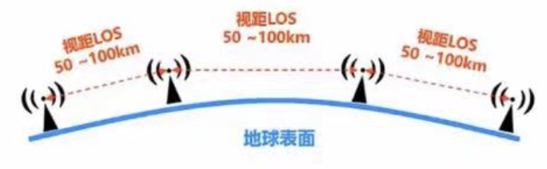
			- 微波通信的信号沿直线传播，因此在地面的传播距离有限，超过一定距离后就要用中继站接力
	- 卫星通信
		-  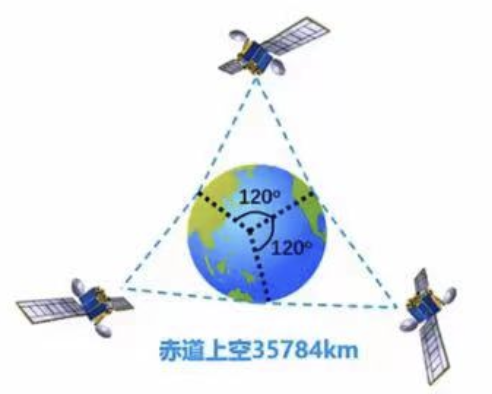
			- 卫星通信利用地球同步卫星作为中继来转发微波信号，可以克服地面微波通信距离限制
	- 低轨道卫星通信系统
		-  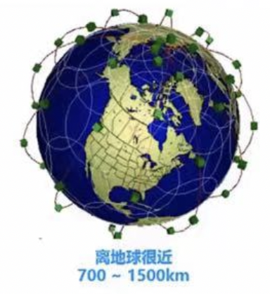
			- 开始部署，构成空间高速链路
- 红外线、激光（直线）
	- 点对点无线传输
	- 直线传输，中间不能有障碍物，传输距离短
## 传输方式
### 串行传输和并行传输
- 串行传输
	- 一个个比特按时间顺序传输
		- 远距离传输
- 并行传输
	- 多个比特通过多条通信信道同时传输
		- 速度快、成本高、近距离传输（计算机内部）
### 同步传输和异步传输
- 同步传输
	- 通过时钟信号控制不同机器同步通信
		- 外同步：在收发双方之间添加一条单独的时钟信号线
		- 内同步：发送端将时钟同步信号编码到发送数据中一起传输（曼彻斯特编码）
- 异步传输
	-  
		- 字节之间异步（字节之间的时间间隔不固定）
		- 字节中的每个比特仍然要同步（各比特的持续时间是相同的）
			- 通过每个字节加起始位和结束位实现字节内的同步
### 通信交互方式
- 单工传输：一个方向通信
- 半双工传输：通信双方都能发送或接收信息，但不能同时
- 全双工传输：通信双方可以同时发送和接收信息，需要两条信道
## 编码与调制
###
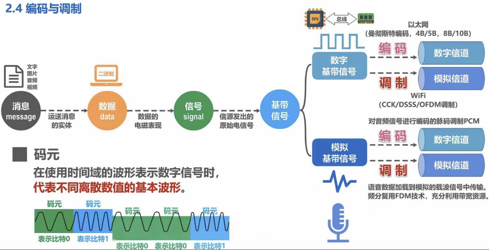
- 术语
	- 数据
		- 模拟数据（模拟信号）：连续变化的数据或信号
		- 数字数据（数字信号）：取值仅允许为有限的几个离散数值的数据成为数字信号或者数字数据
	- 信源
		- 产生和发送数据的源头
	- 基带信号
		- 数字信道上，来自信源的信号，直接表达要传输的信息
	- 码元
		- 一个固定时长的信号波形（数字脉冲）表示一个K进制数字，代表不同离散数值的基本波形（16进制码元->16种形态->4bit数据）
-  
	- 数字数据编码为数字信号（数字发送器）
		-  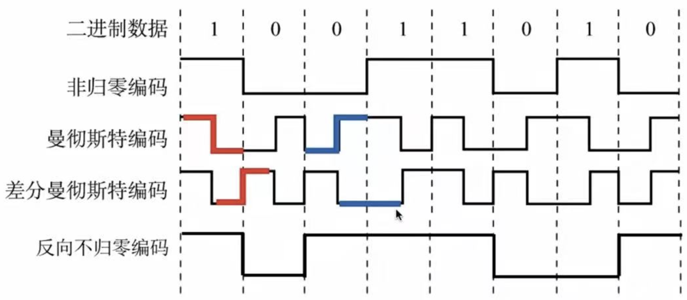
			- 归零编码RZ
				- 归零编码把时钟信号用归零的方式编码在了数据内，称为“自同步”信号
				- 归零占用一部分带宽，传输速率有一定影响
			- 非归零编码NRZ
				- 需要时钟信号线，即外同步（以下四种都可以自同步）
			- 反向非归零编码NRZI
				- 既能传输时钟信号，又不损失系统带宽
			- 曼彻斯特编码
				- 占用的频带宽度是原始基带宽度的两倍（以太网使用）
			- 差分曼彻斯特编码
				- 主要使用在局域网传输
			- 4B/5B编码
				- 将发送的数据流每4位作为一组，然后按照4B/5B编码规则将其转换为相应的5位码
	- 数字数据调制为模拟信号（调制器）
		-  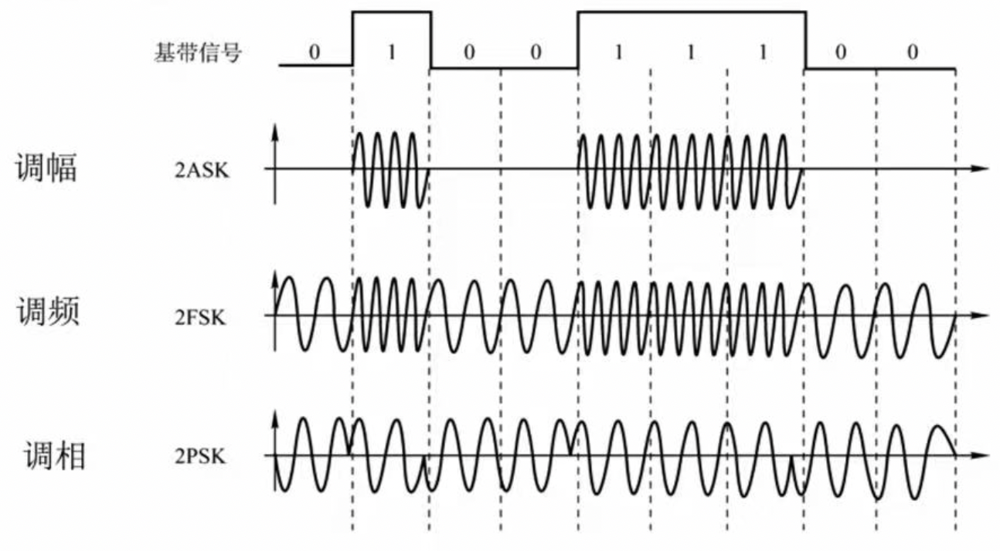
			- 幅移键控 ASK
				- 通过改变载波信号的振幅来表示数字信号1和0，载波的频率和相位不发生改变
			- 频移键控 FSK
				- 通过改变载波信号的频率来表示数字信号1和0，载波的振幅和相位不发生改变
			- 相移键控 PSK
				- 通过改变载波信号的相位来表示数字信号1和0，载波的振幅和频率不发生改变，又分为绝对调相和相对调相
			- 正交振幅调制 QAM
				- 频率相同下，将ASK和PSK结合，形成叠加信号
				- 设波特率为B，采用m个相位，每个相位有n种振幅
					- 数据传播率R = Blog2 (mn) （单位b/s）
-  
	- 模拟数据编码为数字信号（PCM编码器）
		- 采样
			- 对模拟信号进行周期性扫描，把时间上连续的信号变成时间上离散的信号（f采样频率 >= 2f信号最高频率）
		- 量化
			- 把采用取得的电平幅值按照一定的分级标度，转化为对应的数字值并取整数，把连续的电平幅值转换为离散的数字量
		- 编码
			- 把量化的结果转化为与之对应的二进制编码
	- 模拟数据调制为模拟信号（放大器调制器）
		- 频分复用（FDM）技术，充分利用带宽资源
		- 电话局和本地局交换机采用模拟信号传输模拟数据的编码方式，模拟的声音数据是加载到模拟的载波信号中传输的
## 信道的极限容量
### 概述
- 造成信号失真的因素
	- 码元传输速率
	- 信号传输距离
	- 噪声干扰
	- 传输媒体质量
- 概念
	- 波特率/码元传输速率：单位时间内数字通信系统所传输的码元个数（单位是波特，Baud）
	- 比特率/信息传输速率：表示单位时间内数字通信系统传输的二进制码元个数（比特数）单位是比特/秒
### 奈氏准则
- 在假定的理想条件下，为了避免码间串扰，码元传输速率是有上限的
- 公式
	- 理想低通信道的最高码元传输速率 = 2W Baud = 2W (码元/秒 )= 2Wlog2 V (比特/秒)
		- W：信道带宽(Hz)
Baud：波特(码元/秒)
V：每个码元离散电平的数目
- 要提高信息传输速率（比特率），就必须设法使每一个码元能携带更多比特的信息量，需要采用多元制
### 香农公式
- 带宽受限且有高斯白噪声干扰的信道的极限信息传输速率
- 公式
	-  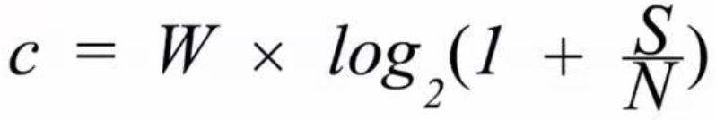
		- C：信道的极限信息传输速率(bit/s)
S：信道内所传信号的平均功率    N：信道内的高斯噪声功率
	- 信噪比(dB) = 10 × log10(S/N) 
		- S/N：信噪比，使用分贝(dB)作为度量单位
- 信道带宽或信道中信噪比越大，信息的极限传输速率越高
### 信道带宽一定的情况下，根据奈氏准则和香农公式，想要提高信息的传输速率就必须采用多元制，和努力提高信道中的信噪比
## 物理层设备
### 中继器
- 概述
	- 将数字信号整形放大（信号再生而非简单放大）再转发出去，消除信号的失真和衰减，进而扩大网络传输的距离
- 缺点
	- 不能连接具有两个不同速率的局域网
	- 中继器出现故障，相邻的两个网段都会产生影响
	- 补充
		- 如果网络设备具有存储转发功能，则可以连接两个不同协议（不同速率的网段）
-  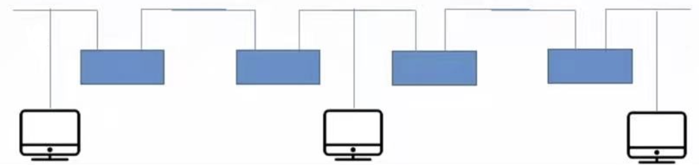
	- 5-4-3原则
		- 互相串联的中继器的个数不能超过4个，4个中继器串联的5段通信介质中只有3段可以挂计算机，其余两段只能用作扩展通信范围的链路段
- 与放大器对比
	- 放大器放大的是模拟信号，原理是将衰减信号放大而不是再生
### 集线器 HUB
-  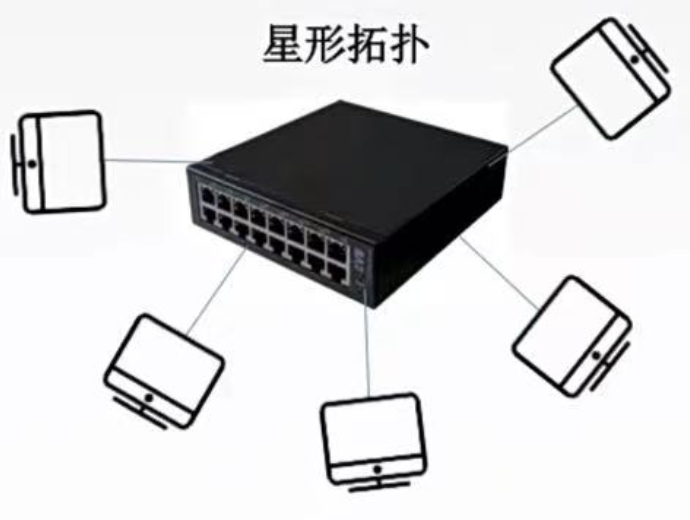
	- 实质是一个多端口的中继器，收到信号后，就将信号从其它端口发出。如果有多端口输入，输入会冲突数据无效
	- 不具有定向传送功能，只能工作在半双工状态下
	- Hub每个端口连接的网络部分是同一个网络的不同网段，不能分割冲突域
	- 多台主机同时交互时，会使其工作效率降低
## b站：分享笔记的好人儿（暂时的名字，可以b站搜索408思维导图）
湖科大课程第二章依旧很无敌，没有一句废话，且知识点连贯
王道的第二章我记得学起来是六章中最混乱
王道书中本章讲的三种交换方式放在了思维导图第一章，确实不是物理层的内容，可能也导致了王道这章讲的很乱
## 红色边框为一级知识点：熟悉
## 橙色边框为二级知识点：掌握
