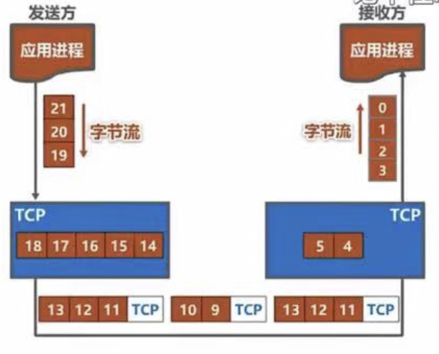

# 第五章 运输层
## 运输层概述
### 之前课程介绍的物理层、数据链路层和网络层共同解决了将主机通过异构网络互联起来所面临的问题，实现了主机到主机的通信
### 实际上计算机网络中进行通信的真正实体是位于通信两端主机中的进程
### 如何为运行在不同主机上的应用进程提供直接的通信服务是运输层的任务（运输层协议又称为端到端协议）
###

- 运输层“直接”为应用进程间的逻辑通信提供服务
- 运输层向高层用户屏蔽了下面网络核心的细节（如网络拓扑、所采用的路由选择协议等），它使应用进程看见的就好像是在两个运输层实体之间有一条端到端的逻辑通信信道
- 根据应用需求的不同，因特网的运输层为应用层提供了两种不同的运输协议，即面向连接的TCP和无连接的UDP，这两种协议就是本章的主要内容
### 功能（王道）
- 传输层提供应用进程之间的逻辑通信（即端到端的通信）
- 复用与分用
	-  
		- 复用：发送方不同的应用进程都可以使用同一个传输层协议传送数据
		- 分用：接收方的传输层在剥去报文的首部后能够把这些数据正确交付到目的应用进程
- 传输层还要对收到的报文进行差错检测（首部和数据部分）
- 提供两种不同的传输协议，即面向连接的TCP和无连接的UDP
## 传输层的寻址与端口
### 端口（传输层的SAP，服务访问点）的作用
- 端口可以标识主机中的应用进程
- 让应用层各种应用进程将其数据通过端口向下交付给传输层，以及让传输层知道应当将报文段中的数据向上通过端口交付给应用层相应的进程
- 端口号只有本地意义，在因特网中不同计算机的相同端口是没有联系的
### 软件端口与硬件端口
- 软件端口：协议栈层间的抽象的协议端口，是应用层的各种协议进程与传输实体进行层间交互的一种地址（传输层使用）
- 硬件端口：路由器、交换机，不同硬件设备进行交互的接口
### 端口号
- 服务端使用的端口号
	- 熟知端口号：0 - 1023
		-  
	- 登记端口号：1024 - 49151
		- 使用这类端口号必须登记在IANA，以防重复
- 客户端使用的端口号：49152 - 65535
	- 又称短暂端口号（临时端口号）：仅在客户进程运行时才动态选择，通信结束后收回
### 套接字
- 套接字 = 主机IP地址 + 端口号
	- IP地址来标识不同主机，端口号区分不同进程
- 在网络中采用发送方和接收方的套接字（Socket）组合来识别端点
	- 唯一地标识网络中的一台主机和其上的一个应用进程
## UDP和TCP的对比
### UDP
-  
	-  
		- 无连接
		- 支持一对一、一对多、多对一和多对多交互通信
		- 对应用层交付的报文直接打包
		- 尽最大努力交付，也就是不可靠；不使用流量控制拥塞控制
		- 首部开销小，仅8字节
### TCP
-  
	-  
		- 面向连接
		- 每条TCP连接只能有两个端点EP，只能是一对一通信
		- 面向字节流
		- 可靠传输，使用流量控制和拥塞控制
		- 首部最小20字节，最大60字节
## UDP
### UDP数据报
- 特点
	- UDP常用于一次性传输较少数据的网络应用，如DNS、SNMP等
	- UDP提供尽最大努力交付，即不保证可靠交付（应用层完成）
	- UDP面向报文（最小处理单位，应用层给多长报文，都照样发）
- UDP首部格式
	-  
		- 长度；UDP数据报的长度（首部+数据），其最小值是8（仅首部，8B）
		- 校验和：检测UDP数据报在传输中是否有错，有错就丢弃。该字段是可选的，当主机不想计算则为0
- 收到数据报
	- 根据首部中的目的端口，把UDP数据报通过相应的端口上交给应用进程
	- 如果接收方UDP发现收到的报文中的目的端口号不正确，丢弃该报文，并由ICMP发送“端口不可达”差错报文给发送方
### UDP校验
-  
	- 伪首部只有在计算校验和时才出现，不向下传送也不向上递交
	- 17：封装UDP报文的IP数据报首部协议字段是17
	- UDP长度：UDP首部8B+数据部分长度（不包括伪首部）
- 校验过程
	-  
## TCP连接管理
### 连接的三个阶段
- 连接建立
	- 数据传送
		- 连接释放
###

### 连接已建立后
- TCP服务器进程没收到一次TCP客户进程的数据，就重新设置并启动保活计时器（2H）
- 若保活计时器到时后，TCP服务器进程就向TCP客户进程发送一个探测报文段（每75s一次，十次后仍无响应，则关闭连接）
###

## SYN洪泛攻击
### SYN洪泛攻击发生在OSI传输层，这种方式利用TCP协议的特性，即三次握手
### 攻击者发送大量TCP SYN，SYN是TCP三次握手中的第一个数据包，当服务器返回ACK后，攻击者不对其进行再确认
### 那这个TCP连接就处于挂起状态（半连接状态），服务器收不到再确认的话，还会重复发送ACK给攻击者
### 攻击者对这些服务器发送非常大量的这种TCP连接；服务器上这些TCP连接会因为挂起状态而消耗CPU和内存，最后服务器可能死机
## TCP可靠传输的实现
### 可靠
- 接收方读出字节流与发送方一致（顺序、内容）
###

- 发送方在未收到接收方的确认时，可将发送窗口内还未发送的数据全部发送出去
- 接收方只接收序号落在发送窗口内的数据
- TCP要求接收方必须有累积确认和捎带确认机制
- 接收方不应过分推迟发送确认，会导致发送方不必要的超时重传
### 校验
### 序号
- TCP首部的序号字段用来保证数据能有序提交给应用层，序号建立在传送的字节流之上
### 确认
- TCP首部的确认号表明期望收到对方的下一个报文段数据的第一个字节的序号
	- TCP默认使用累计确认
### 重传
- 超时
	- TCP每发送一个报文段，就对这个报文段设置一次计时器。计时器设置的重传时间到期但还未收到确认时，就要重传这一报文段
- 冗余ACK
	- 再次确认某个报文段的ACK，而发送方先前已经收到过该报文段的确认
	- 当收到对于某个报文段的3个冗余ACK，可以认为该报文段已经丢失（快速重传），这时发送方可以立即对该报文执行重传
## 超时重传时间的选择
###

- 超时重传时间RTO因略大于往返时间RTT
- 利用每次测量得到的RTT样本，计算加权平均往返时间RTTs
### 举例
-  
	- 针对出现超时重传时无法测准往返时间RTT的问题
	- Karn提出计算加权平均往返时间RTTs时，只要报文段重传，就不采用其往返时间RTT样本
	- 对Karn修正后：报文段每重传一次，就把超时重传时间RTO增大一些，RTO新 = RTO旧 * 2
## TCP流量控制
### 一般来说我们总希望数据传输快一些
- 但如果数据发送过快，接收方可能来不及接收，造成数据丢失
### 流量控制：让发送方的发送速率不要太快，让接收方来得及接收
###

- 利用滑动窗口机制可以在TCP连接上实现对发送方的流量控制
- 发送窗口 = Min{接收窗口，拥塞窗口}
	- 接收方根据自己的接收窗口的大小，动态调整发送方发送窗口的大小，限制发送速率
	- 发送方根据其对当前网络拥塞的估计而确定拥塞窗口值，大小与网络带宽和时延有关
- TCP发送方收到接收方的零窗口通知后，应启动持续计时器。持续计时器超时后，向接收方发送零窗口探测报文
## TCP拥塞控制
### 概述
-  
	- 拥塞
		- 对网络中某一资源的需求超过了该资源所能提供的可用部分，网络性能就要变坏
	- 拥塞控制
		- 防止过多数据注入网络，保证网络中的路由器或链路不致过载
	- 若出现拥塞而不进行控制，整个网络的吞吐量将随输入负荷的增大而下降
### 四种拥塞控制算法的条件
- 数据是单方向传送，而另一个方向只传送确认
- 接收方总是有足够大的缓存空间，因而发送方发送窗口的大小由网络的拥塞程度来决定
- 以最大报文段MSS的个数为讨论问题的单位，而不是以字节为单位
### 慢开始+拥塞避免
-  
	- 慢开始
		- 是指一开始向网络注入的报文段少，而非增长速度慢
		- 每经过一个传输轮次（RTT）拥塞窗口翻倍
		- 关注于一个传输轮次，每收到一个新报文段的确认后，拥塞窗口+1，宏观体现为翻倍
	- 拥塞避免并非完全能够避免拥塞，而是指在拥塞避免阶段将拥塞窗口控制为按线性规律增长，使网络比较不容易出现拥塞
### 快重传+快恢复
-  
	- 所谓快重传，就是使发送方尽快进行重传，而不是等超时重传计时器超时再重传
	- 要求接收方不要等待自己发送数据时才进行捎带确认，而是立即发送确认
	- 即使收到了失序的报文段也要立即发出对已收到报文段的重复确认
	- 发送方一旦收到三个连续的重复确认，就将相应的报文段立即重传，而非等待超时再重传
	- 对于个别丢失的报文段，发送方不会出现超时重传，不会误以为是拥塞，可提高20%网络吞吐量
## TCP报文段首部格式
###

- 为了实现可靠传输，TCP采用面向字节流的方式
- 但TCP发送数据时，从发送缓存取出一部分或全部字节并给其添加一个首部使之成为TCP报文段后进行发送
	- 一个TCP报文段由首部和数据载荷两部分构成
	- TCP的全部功能都体现在它首部中各字段的作用
###

- 源端口和目的端口：标识该TCP报文段的应用进程
- 序号：指出本TCP报文段数据载荷的第一个字节的序号
- 确认号：期望收到对方下一个数据报的数据载荷的第一个字节的序号，也是对收到所有数据的确认
	- 若确认号=n，n-1数据已经正确接收
- 数据偏移：指出TCP报文段的数据起始处距离TCP报文段的起始处有多远（指出首部长度）
	- 单位为4字节
- 保留：今后使用
- URG：紧急指针字段有效
- ACK：取值为1时确认号字段才有效
- PSH：报文段尽快上交应用进程，不必等到接收缓存都填满后再向上交付
- RST：用来复位TCP连接，为1时，表明TCP连接出现了异常，必须释放连接再重新建立连接；还用来拒绝一个非法的报文段或拒绝打开一个TCP连接
- SYN：在TCP连接建立时用来同步序号
- FIN：用来释放TCP连接
- 窗口：指出发送本报文段一方的接收窗口
- 校验和：检查包括TCP报文段首部和数据载荷两部分（校验时需加上前面12字节伪首部）
- 紧急指针：指出在本报文段中紧急数据共有多少字节（当发送方有紧急数据时，可将紧急数据插队到发送缓存的最前面）
- 选项
	- 最大报文段长度MSS选项：TCP报文段数据载荷部分的最大长度
	- 窗口扩大选项：为了扩大窗口（提高吞吐率）
	- 时间戳选项：用来计算往返时间RTT；用于处理序号超范围情况
	- 选择确认选项
- 填充：使整个首部长度是4B的整数倍
## 王道没有具体展开，但是是一个重要的问题，弹幕说重邮似乎考过，可能作为面试问题
## b站：分享笔记的好人儿（暂时的名字，可以b站搜索408思维导图）
湖科大老师生动地图示了传输层过程，增加了不同纬度UDP和TCP的比较，具体论述了超时重传问题，但没有具体讲解UDP，缺少SYN洪泛攻击，讲解顺序与王道不同（仅将首部格式调整到最后，感觉有之前的基础才能明白首部格式里的有啥用）
## 红色边框为一级知识点：熟悉
## 橙色边框为二级知识点：掌握
