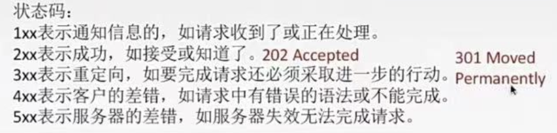

# 第六章 应用层
## 网络层概述
###

- 解决通过应用进程的交互来实现特定网络应用的问题
- 解决进程之间基于网络的通信问题
- 解决分组在多个网络上传输（路由）的问题
- 解决分组在一个网络（或一段链路）上的传输的问题
- 解决使用何种信号来传输比特的问题
### 应用层是计算机网络体系结构的最顶层，是设计和建立计算机网络的最终目的，也是计算机网络中发展最快的部分
###

## 网络应用模型
### 客户/服务器方式（C/S方式）
-  
	- 客户和服务器是指通信中所涉及的两个应用进程
	- 客户/服务器方式所描述的是进程之间服务和被服务的关系
	- 客户是服务请求方，服务器是服务提供方
	- 主要特征
		- 服务器总是处于运行状态，并等待客户的服务请求。服务器具有固定端口号，而运行服务器的主机也有固定IP地址
		- 可扩展性不强
	- C/S模型的应用
		- Web、FTP、远程登录、电子邮件
### 对等方式（P2P方式）
-  
	- 概述
		- 没有固定的服务请求者和服务提供者，分布在网络边缘各端系统中的应用进程是对等的，被称为对等方。对等方相互之间直接通信，每个对等方既是服务的请求者，又是服务的提供者
	- 优点
		- 减轻了服务器的计算压力，消除了对某个服务器的完全依赖，提高了效率和资源利用率
		- 可扩展性好，系统每增加一个对等方，不仅增加的是服务的请求者，也增加了服务提供者，系统性能不会因规模的增大而降低
		- 具有成本上的优势，通常不需要庞大的服务器设施和服务器带宽
		- 网络健壮性强，单个结点的失效不会影响其他部分的结点
	- 缺点
		- 占用较多的内存，影响整机速度
		- P2P下载会对硬盘造成较大损伤
		- 使网络变得非常拥塞
	- P2P应用
		- PPlive、Bittorrent等
## 域名系统（DNS）
### 基本概述
-  
	- 域名系统（DNS）是因特网使用的命名系统，用来把便于人们记忆的具有特殊含义的域名（如www.baidu.com）转变为便于机器处理的IP地址
	- DNS系统采用C/S模型，运行在UDP上，端口 53
### 域名系统DNS
-  
	- 因特网采用层次树状结构的域名结构
	- 域名的结构由若干个分量组成，各分量之间用“点”隔开，分别代表不同级别的域名
-  
	- 域名规则
		- 英文+数字+“-”，不区分大小写，不超过63个字符
	- 各级域名由其上一级的域名管理机构管理，域名系统既不规定一个域名包含多少个下级域名，也不规定每一级的域名代表什么意思
### 域名服务器
-  
	- 概述
		- 因特网的域名系统被设计成一个联机分布式的数据库系统，并采用客户/服务器模型
	- 分类
		- 根域名服务器
			- 是最高层次的域名服务器，所有的根域名服务器都知道所有的顶级域名服务器的IP地址
		- 顶级域名服务器
			- 负责管理在顶级域名服务器注册的所有二级域名
			- 收到DNS查询请求时，就给出相应的回答
		- 授权域名服务器（权限域名服务器）
			- 每台主机都必须在授权域名服务器处登记
			- 授权域名服务器总能将管辖的域名转变为该域名的IP地址
		- 本地域名服务器
			- 当一台主机发出DNS查询请求时，这个查询请求报文就发送给该主机的本地域名服务器（每个ISP，或一所大学，一个专业都可以拥有一个本地域名服务器）
### 域名解析过程
- 递归查询
	-  
- 迭代查询
	-  
- 高速缓存
	-  
		- 为了提高DNS的查询效率，并减轻根域名服务器的负荷和减少因特网上的DNS查询报文数量
		- 域名和IP地址的映射不是永久的，域名服务器将在一段时间后丢弃高速缓存中的信息
		- 不但本地域名服务器需要高速缓存，用户主机也需要（主机启动时从本地域名服务器下载域名和IP地址的数据库）
### 例题讲解（我记得当时听讲解听的很怪）
-  
## 文件传输协议（FTP）
### 概述
- 文件传输协议FTP是因特网上使用最广泛的文件传送协议
- 功能
	- 屏蔽了各计算机系统的细节，适合于在异构网络中任意计算机之间传送文件
	- 提供交互式的访问，允许客户指明文件的类型与格式，允许文件由存取权限
	- 以匿名方式提供公用文件共享的能力
- 工作方式
	- 客户/服务器方式+TCP
	- 服务器进程
		- 主进程：负责接收新的请求；若干从属进程：处理单个请求
### 过程
-  
	- FTP客户和服务器之间要建立以下两个并行的TCP连接
	- 控制连接
		- 在整个会话期间一直保持打开，用于传送FTP相关控制命令
	- 数据连接（带外传送）
		- 用于文件传输，在每次文件传输时才建立，传输结束就关闭
	- 默认情况下，FTP使用TCP 21端口号进行控制连接，TCP 20端口进行数据连接（主动方式使用TCP 20端口，被动方式由服务器和客户端自行协商决定）
	- 传输模式
		- 文本模式：ASCII模式
		- 二进制模式：Binary模式
## 电子邮件（E-mail）
### 电子邮件系统的组成结构
- 用户代理
	- 用户与电子邮件系统的接口
- 邮件服务器
	- 组成电子邮件系统的核心，功能是发送和接收邮件，同时向用户回报发送情况
- 邮件发送协议和读取协议
	- SMTP：邮件发送协议，用于用户代理向邮件服务器发送邮件或在邮件服务器之间发送邮件
	- POP3：邮件读取协议，用于用户代理从邮件服务器读取邮件
### 电子邮件的收发过程
-  
### 简单邮件传输协议 SMTP
- 概述
	- 一种提供可靠且有效的电子邮件传输协议，它控制两个互相通信的SMTP进程交换信息
	- 使用C/S方式
		- 发送邮件的SMTP进程是SMTP客户
			- 负责接收邮件的SMTP进程是SMTP服务器
	- TCP连接，端口号：25
- 通信阶段
	-  
- 缺点
	- 不能传送可执行文件或其他二进制对象
	- 仅限于传送7位ASCII码，不能传送其他非英语国家的文字
	- 会拒绝超过一定长度的邮件
### 多用途网际邮件扩充 MIME
- 为解决SMTP传送非ASCII码文本的问题
	-  
		- 增加了5个新的邮件首部字段，这些字段提供了有关邮件主体的信息
		- 定义了许多邮件内容的格式，对多媒体电子邮件的表示方式进行了标准化
		- 定义了传送编码，可对任何内容格式进行转换，而不会被邮件系统改变
### 邮局协议 POP3
- 概述
	- 当用户读取邮件时，用户代理向邮件服务器发出请求，拉取用户邮箱中的邮件
	- 使用客户/服务器的工作方式
		- 基于TCP连接的C/S方式，端口号：110
- 工作方式：下载并保留/下载并删除
### 因特网报文存取协议 IMAP4
- 允许用户代理只获取报文的某些部分，用户打开邮箱时，可以看到邮件首部。若用户需要打开某邮件，邮件才会下载到计算机上
- 为了用户提供了创建文件夹，在不同文件夹之间移动邮件及在远程文件夹中查询邮件的命令，为此IMAP服务器维护了会话用户的状态信息
- 基于TCP连接的C/S方式，端口号143
### 基于万维网的电子邮件
-  
	- 用户浏览器与Hotmail或Gmail的邮件服务器之间的邮件发送或接收使用HTTP，在不同邮件服务器之间传送邮件时使用SMTP
## 万维网（WWW）
### WWW的概念与组成结构
- 万维网 WWW
	- 是一个资料空间，资源由一个全域“统一资源定位符”（URL）标识，通过超文本传输协议（HTTP）传送给使用者
- 内核部分标准构成
	- 统一资源定位符（URL）
		- 负责标识万维网上的各种文档，并使每个文档有唯一标识符
			-  
	- 超文本传输协议（HTTP）
		- 应用层协议，使用TCP进行可靠传输，是客户与服务器程序交互必须严格遵守的协议
	- 超文本标记语言（HTML）
		- 文档结构的标记语言，它使用一些约定的标记对页面上的各种信息（文字、声音、图像、视频）、格式进行描述
- 工作流程
	- Web用户使用浏览器（指定URL）与Web服务器建立连接，并发送浏览请求
	- Web服务器把URL转换为文件路径，并返回信息给Web浏览器
	- 通信完成，关闭连接
### 超文本传输协议 HTTP
- 概述
	- 概念
		- HTTP定义了浏览器（万维网客户进程）怎样向万维网服务器请求万维网文档，以及服务器怎样把文档传送给浏览器
	- 特点
		- 无状态（同一个客户第二次访问同一个服务器的页面，服务器的响应过程与第一次相同）
			- 引出Cookie技术
		- 基于TCP，保证数据可靠传输
- HTTP的操作过程
	- 每个万维网站点都有一个服务器进程，不断监听TCP端口 80，当监听到连接请求后，便与浏览器建立连接
	- TCP连接建立后，浏览器就向服务器发送请求获取某个Web页面的HTTP请求
	- 服务器收到HTTP请求后，将构建所请求Web页的必须信息，并通过HTTP响应返回给浏览器
	- 浏览器将信息进行解释，然后将Web页显示给用户，TCP连接释放
- 网站访问实例
	-  
- 非持续连接
	-  
		- HTTP/1.0采用非持续连接方式
			- 每个页面元素对象的传输都需要单独建立一个TCP连接
- 持续连接（非流水线）
	-  
		- HTTP/1.1采用持续连接
			- 指万维网服务器在发送响应后仍然保持这条连接，使同一个客户可以继续在这条连接上传送后续的HTTP请求与响应报文
		- 非流水线
			- 客户在收到前一个响应后，才能发出下一个请求
		- HTTP/1.1为了进一步提高效率，可采用流水线方式
			- 客户每遇到一个对象引用，就立即发出一个请求
			-  
### HTTP的报文结构
- HTTP是面向文本的，报文中每个字段都是一些ASCII码，并且长度不固定
- 报文类型
	- 请求报文：从客户向服务器发送的请求报文
		-  
			-  
				-  
	- 响应报文：从服务器到客户的回答
		-  
			-  
### Cookie
- 概念
	- Cookie提供了一种机制使得万维网服务器能够“记住”用户，是一种对无状态的HTTP进行状态化的技术
- 过程
	-  
### 万维网缓存与代理技术
-  
## 很有意思的是湖科大老师写服务提供商对于将P2P方式应用的兴趣越来越大
王道写各大ISP通常对P2P应用持反对态度
## b站：分享笔记的好人儿（暂时的名字，可以b站搜索408思维导图）
今天的好消息是408全部结束了，坏消息是我的小红书被举报直接封号，这几年的朋友圈没了，之后小红书发一篇完整地就挂机着吧
B站
已经有一个学习思路也是思维导图使用指南视频
马上做一个四门大学老师课程与王道的比较
10月可能会说一下选学校的失败教训？有点主观不一定
11月会出考前过一眼的浓缩版思维导图（一张纸一本书）
考完应该会立刻做一个有意思的游戏（还没想好）
从0开始丝滑学算法的小小指南（应对上机）
总之我不会停留在考研，毕竟没有想着卖笔记盈利，只是伴随我的生活分享一些有用的东西
## 红色边框为一级知识点：熟悉
## 橙色边框为二级知识点：掌握
