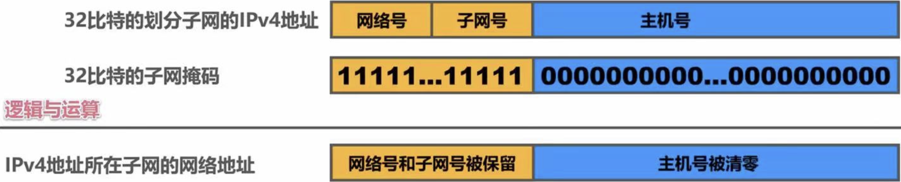
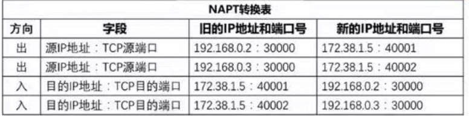

# 第四章 网络层

## 网络层概述（湖科大）

### 网络层的主要任务是实现网络互连，进而实现数据包在各网络之间的传输

### 网络层任务

- 网络层向运输层提供怎样的服务（可靠传输/不可靠传输）

- 网络层寻址问题

- 路由选择问题

### TCP/IP协议栈

- 因特网是目前全世界数量最多的互联网，使用TCP/IP协议栈

-  

	- 网络接口层包括了物理层和数据链路层

### 提供两种服务

-  

	- 数据报服务

		- 由于网络本身不提供端到端的可靠服务，使网络中路由器可以做得比较简单、价格低廉（电信网交换机相比较）

		- 因特网设计思想：将复杂的网络处理功能置于因特网的边缘（用户主机和其内部的运输层），相对简单的尽最大努力的分组交付功能置于因特网核心

	- 由于TCP/IP体系结构的因特网的网络层提供的是简单灵活、无连接的、尽最大努力交付的数据报服务，因此本章主要围绕网络层如何 传送IP数据报讨论

## 网络层功能（王道）

### 异构网络互联

- 网络互联

	- 将两个以上的计算机网络，通过一定的方法，用一种或多种通信处理设备（即中继系统）相互连接起来，以构成更大的网络系统

- 中继系统

	- 物理层中继系统

		- 中继器、集线器

	- 数据链路层中继系统

		- 网桥或交换机

	- 网络层中继系统

		- 路由器（相互连接的网络可以是异构的）

	- 网络层以上中继系统

		- 网关

- 虚拟互联网络

	- 逻辑互联网络，即互联的各种物理网络的异构性本来是客观存在的，但通过使用IP就可以使这些性能各异的网络在网络层上看起来是一个统一的网络

	- 即互联网主机通信，好像就在一个网络上，看不见网络异构细节

### SDN的基本概念（近年新考点）

-  

	- 数据平面（转发、位于路由器中、硬件）

	- 控制平面（路由选择、软件）

		- 传统方法：位于路由器中

		- SDN：位于远程控制器中

			- 网络控制应用程序

			- SDN控制器

				- 北向接口：SDN控制器通过“北向接口”与网络控制应用程序交互

				- 网络范围状态管理层：做出最终控制决定，要求有网络主机、链路等最新状态信息

				- 通信层（南向接口、通信协议）：SDN控制器与受控网络设备之间的通信，包含“南向接口”

			- 受控网络设备

### 路由与转发（路由选择+分组转发）

### 用塞控制

- 概念

	- 在通信子网中，因出现过量的分组而引起网络性能下降的现象称为拥塞

- 判断方法

	- 轻度拥塞：随着网络负载的增加，网络的吞吐量明显小于正常的吞吐量

	- 拥塞状态：网络的吞吐量随着网络负载的增大而下降

	- 死锁状态：网络的负载继续增大，而网络的吞吐量下降到0

- 实现

	- 合理优化主机、路由器和路由器内部的转发处理过程

	- 单一的增加资源不能解决拥塞问题

- 拥塞控制的方法

	- 开环控制

		- 设计网络时事先将有关发生拥塞的因素考虑到

	- 闭环控制

		- 事先不考虑有关发生拥塞的各种因素，采用监测网络系统去监视，及时检查哪里发生了拥塞，然后将拥塞信息传到适合的地方

## IP数据报的发送

### IPv4数据报

- 数据报首部

	-  

		- 版本：指IP版本，目前广泛使用的版本号是4

		- 首部长度：最大值为60B，最常用20B

			- 基本单位为4B

		- 总长度：首部与数据之和，最大为65535B

			- 基本单位为1B

		- 标识：计数器，每产生一个数据报就+1

		- 标志：3位，最低位MF，中间位DF

			- MF：More Fragment（1表还要分片，0表最后一个分片）

			- DF：Don't Fragment（1表不能分片，0表可以分片）

		- 片偏移：指出分片后，某片在原分组中的相对位置

			- 基本单位为8B

		- 生存时间 TTL：防止路由环路，每次转发TTL - 1，当TTL为0则丢弃

		- 协议：指出该分组使用的协议（TCP：6，UDP：17）

			-  

		- 首部校验和：仅校验分组的首部

		- 源地址字段/目的地址字段：IP地址

- 数据报数据部分

	- 最大传送单元 MTU：一个链路层数据报能承载的最大数据量

		- 以太网：1500B

		- 广域网：576B

	- 分片：当数据报长度大于链路MTU时，就要对其进行分片传输，分片会在目的地进行组装，不会在中间路由处组装

###  

- 主机发送IP数据报

	- 判断主机是否与自己在同一个网络（本机IP地址与子网掩码相与得到主机的网络地址，目的IP地址与本机的子网掩码相与得到目的网络地址，判断是否相等）

		- 若在同一个网络，则属于直接交付

		- 若不在同一个网络，则属于间接交付，传输给主机所在的默认网关

- 路由器转发IP数据报

	- 检查IP数据报首部是否出错

		- 若出错，则直接丢弃该IP数据报并通告源主机

		- 若未出错，则进行转发

	- 根据IP数据报的目的地址在路由表中查找匹配的条目

		- 若找到匹配的条目，则转发给条目中指示的下一跳

		- 若找不到，则丢弃该IP数据报并通告源主机

	- 某主机发送本网段或其他网段的广播数据报，路由器不会转发

### 静态路由配置及其可能产生的路由环路问题

- 静态路由配置：给路由器人工配置路由表

	- 方式简单、开销小。但不能及时适应网络状态（流量、拓扑等）的变化

	- 一般在小规模网络中采用

- 路由环路的错误

	-  

		- 配置错误

		- 聚合了不存在的网络

			- 以此举例，解决：给R2路由表添加黑洞路由

		- 网络故障

- 路由表条目类型

	-  

		- 直连网络

		- 静态路由（人工配置）

		- 动态路由（路由选择协议）

- 特殊的静态路由条目

	- 默认路由（目的网络0.0.0.0，地址掩码0.0.0.0）

	- 特定主机路由（目的网络为特定主机的IP地址，地址掩码为255.255.255.255）

	- 黑洞路由（下一跳null 0）

## IPv4地址

### 概述

- IPv4地址就是给因特网上的每一台主机（或路由器）的每一个接口分配一个在全世界范围内是唯一的32比特的标识符

- 32比特的IPv4地址不方便阅读、记录以及输入等，因此IPv4地址采用点分十进制表示方法以方便用户使用

### 分类编址（1981年）

-  

	- 原则

		- 只有A、B、C类地址可分配给网络中的主机或路由器的各接口

		- 主机号为“全0”的地址是网络地址，不能分配给主机或路由器的各接口

		- 主机号为“全1”的地址是广播地址，不能分配给主机或路由器的各接口

		- 当A类地址时

			- 网络号“全0”，保留不指派；

			- 网络号“全1”，127，作为本地环回测试地址，不指派

	-  

### 以下方式是为了缓解IPv4地址不够用

### 划分子网（1985年）

- 为新增网络申请新的网络号会带来以下弊端

	- 需要等待时间和花费更多的费用

	- 会增加其他路由器中路由表记录的数量

	- 浪费原有网络号中剩余的大量IP地址

-  

	- 可以从主机号部分借用一部分比特作为子网号

	- 子网掩码使用连续的1来对应网络号和子网号；用连续的0来对应主机号

	- 将划分子网的IPv4地址与其相应的子网掩码进行逻辑与运算就可得到IPv4地址所在子网的网络地址

- 默认的子网掩码是指在未划分子网的情况下使用的子网掩码

	- A类：255.0.0.0              B类：255.255.0.0                 C类：255.255.255.0

### 无分类编址（1993）

- 引入

	- 划分子网在一定程度上缓解了因特网在发展中遇到的困难，但是数量巨大的C类网因为其地址空间太小并没有得到充分使用，而因特网的IP地址仍在加速消耗

		- 提出无分类编址的方法

- 无分类域间路由选择CIDR

	- CIDR消除了传统的A类、B类和C类地址，以及划分子网的概念，可以更加有效地分配IPv4的地址空间

	- 使用“斜线记法”，斜线后面写上网络前缀所占的比特数量 e.g. 218.75.230.0/24

	- 实际上是将网络前缀都相同的连续的IP地址组成一个“CIDR地址块”

- 路由聚合

	-  

		- 路由聚合（构造超网）的方法是找共同前缀

		- 网络前缀越长，地址块越小，路由越具体

		- 若路由器查表转发分组时发现有多条路由可选，则选择网络前缀最长的那条，称为最长前缀匹配（最具体的路由）

### 定长/变长子网掩码

- 定长的子网掩码FLSM

	-  

		- 使用同一个子网掩码来划分子网

		- 子网划分方式不灵活：只能划分出2^n个子网（n是从主机号部分借用的用来作为子网号的比特数量）

		- 每个子网所分配的IP地址数量相同，容易造成IP地址浪费

- 变长的子网掩码VLSM

	-  

		- 使用不同的子网掩码来划分子网

		- 子网划分方式灵活：可以按需分配

		- 每个子网所分配的IP地址数量可以不同，尽可能减少对IP地址的浪费

### NAT（1994）

- 概述

	- 通过将专用网络地址转换为公用地址，从而对外隐藏内部管理的IP地址，目的同样也是延缓IPv4地址用尽

- 过程

	-  

		- NAT路由器至少有一个有效的外部全球地址，私有地址<-------->公有地址（软件）

		- 私有地址

			- 划分部分IP地址为私有地址，私有地址不能直接用于互联网

			-  

		- NAT转换表

			-  

## 路由转发过程

### 路由算法

- 静态路由算法

	- 非自适应路由算法，由网络管理员手工配置的路由信息

	- 大型和复杂的网络环境通常不宜采用，管理员难以全面了解网络拓扑变化；发生改变后需大范围修改和调整路由信息

- 动态路由算法

	- 距离-向量路由算法

		- 所有结点都定期地将它们的整个路由选择表传送给所有与之之间相邻的结点

		- 路由选择表内容

			- 每条路径的目的地（另一结点）

			- 路径的代价

		- 更新条件

			- 被通告一条新的路由，该路由在本结点的路由表中不存在，此时本地系统加入这条路由

			- 来的路由信息中有一条到达某个目的地的路由，该路由与当前使用的路由相比，有较短的距离（较小的代价）

		- 容易出现路由环路问题，RIP

	- 链路状态路由算法

		- 原理

			- 链路状态路由算法要求每个参与该算法的结点都具有完全的网络拓扑信息

			- 主动测试所有邻接结点的状态

			- 定期地将链路状态传播给所有其他结点（或称路由结点）

		- 特点

			- 使用洪泛法向所有相邻的路由器发送信息，然后相邻路由器又向其他相邻路由器发送信息

			- 发送的信息是与路由器相邻的所有路由器的链路状态，但这只是路由器所知道的部分信息

			- 只有当链路状态发生变化时，路由器才向所有路由器发送此信息

		- 用于大型或路由变化骤敛的环境，OSPF

- 层次路由

	-  

		- 内部网关协议IGP

			- 路由信息协议RIP（基于距离向量）

			- 开放式最短路径优先OSPF（基于链路状态）

		- 外部网关协议EGP

			- 边界网关协议BGP

### 路由信息协议RIP

- 概述

	- RIP要求自治系统AS内每个路由器维护从它自己到AS内其他每个网络的距离记录。这是一组距离，称为“距离向量”

	- RIP使用跳数作为度量来衡量到达目的网络的距离，距离等于16时不可达，因此RIP只适用于小型互联网

	- 当到达同一目的网络有多条“距离相等”的路由时，可以进行等价负载均衡

	- 应用层协议，使用UDP

- 要点

	- 和谁交换信息

		- 仅和相邻路由器交换信息

	- 交换什么信息

		- 自己的路由表

	- 何时交换信息

		- 周期性交换（例如每30秒）

- 基本过程

	-  

		- 路由器刚开始工作时，只知道自己到直连网络的距离为1

		- 每个路由器仅和相邻路由器周期性地交换并更新路由信息

		- 若干次交换和更新后，每个路由器都知道到达AS内各网络的最短距离和下一跳地址，称为收敛

- 坏消息传播得慢

	-  

		- 又称路由环路或距离无穷计问题，这是距离向量算法的一个固有问题

		- 解决

			- 限制最大路径距离为15（16不可达）

			- 当路由器发生变化时就立即发送更新报文“触发更新”，而非周期性发送

			- 让路由器记录收到某特定路由信息的接口，不让同一路由信息再通过此接口的反方向传送“水平分割”

### 开放最短路径优先OSPF

- 概述

	- OSPF是基于链路状态的，而不像RIP基于距离向量

	- 采用最短路径算法SPF计算路由，保证不会产生路由环路，不限制网络规模，更新/收敛速度快

	- 链路状态

		- 指路由器都和哪些路由器相邻，以及相应链路的“代价”（代价：费用、距离、时延、带宽等）

- 基本过程

	-  

		- OSPF的每个路由器都会产生链路状态通告LSA，包含

			- 直连网络的链路状态信息

			- 邻居路由器的链路状态信息

		- LSA被封装在链路状态更新分组LSU中，采用洪泛法发送

		- 使用OSPF的每个路由器都有一个链路状态数据库LSDB，用于存储LSA

		- 通过各路由器洪泛发送封装有自己LSA的LSU分组，各路由器的LSDB最终一致（30min刷新链路状态）

		- 使用OSPF的各路由器基于LSDB进行最短路径优先SPF计算，构建出各自达到其他路由器的最短路径，即构建各自路由表

- 分组类型

	- 问候分组：用来发现和维持邻站的可达性

	- 数据库描述分组：向邻站给出自己的链路状态数据库中的所有链路状态项目的摘要信息

	- 链路状态请求分组：向对方请求发送某些链路状态项目的详细信息

	- 链路状态更新分组：用洪泛法对全网更新链路状态

	- 链路状态确认分组：对链路更新分组的确认

- 为了使OSPF能够用于规模很大的网络，OSPF把一个自治系统再划分为若干个更小的范围，叫做区域

### 边界网关协议BGP

- 概述

	- 自治系统之间的路由选择必须考虑相关政策（政治、经济、安全等）

	- BGP只能是力求寻找一条能够到达目的网络且比较好的路由（不能兜圈子），而非要寻找一条最佳路由

	- BGP支持CIDR，所以路由表也该包括目的网络前缀

	- 在BGP刚运行时，BGP的邻站交换整个BGP路由表，但以后只需在发生变化时更新有变化的部分

- 过程

	-  

		- 在每个自治系统的管理员要选择至少一个路由器作为该自治系统的“BGP发言人”（BGP边界路由器）

		- 一个BGP发言人与其他自治系统中的BGP发言人要交换路由信息，先建立 TCP连接

			- 应用层协议、基于TCP

			- 交换：到达某个网络所要经过的一系列AS（完整路径）

		- 再利用BGP会话交换路由信息

		- 所有BGP发言人都互相交换网络可达性的信息后，各BGP发言人就可找出到达各个自治系统的较好路由

- 报文类型

	- OPEN（打开）报文：用来与相邻的另一个BGP发言人建立关系，使通信初始化

	- UPDATE（更新）报文：用来通告某一路由的信息，以及列出要撤销的多条路由

	- KEEPALIVE（保活）报文：用来周期性地证实邻站的连通性

	- NOTIFICATION（通知）报文：用来发送检测到的差错

### 比较

- 协议

	- RIP

		- OSPF

			- BGP

- 类型

	- 内部

		- 内部

			- 外部

- 传递协议

	- UDP

		- IP

			- TCP

				- 可以巧记IU（大美女），IO（IO总不会忘吧），BT（变态）

- 层级

	- 应用层

		- 网络层

			- 应用层

- 路由算法

	- 距离-向量

		- 链路状态

			- 距离-向量

- 路径选择

	- 跳数最少

		- 代价最低

			- 较好、非最佳

- 交换结点

	- 和本结点相邻路由器

		- 网络中所有路由器

			- 和本结点相邻路由器

- 交换内容

	- 当前本路由器全部信息，即自己路由表

		- 与本路由器相邻的所有路由器的链路状态

			- 首次：整个路由表
更新：有变化的部分

## ARP、DHCP、ICMP

### 数据包转发过程，MAC与IP地址变化

-  

	- 数据包转发过程中源IP地址和目的IP地址不变

	- 数据包转发过程中源MAC地址和目的MAC地址逐个链路（网络）改变

### ARP

- 已知设备所分配到的IP地址，使用ARP协议可以通过该IP地址获取到设备的MAC地址

-  

	- 过程

		- 源主机在自己的ARP高速缓存表中查找目的主机的IP地址对应的MAC地址

			- 找到，则封装MAC帧进行发送

			- 未找到，则发送ARP请求报文（封装在广播MAC帧中）

		- 目的主机收到ARP请求后，将源主机的IP地址与MAC地址记录到自己的ARP高速缓存表，给源主机发送ARP响应（封装在单播MAC帧中），ARP响应中包含目的主机的IP地址和MAC地址

		- 源主机收到ARP响应后，将目的主机的IP地址与MAC地址记录到自己的ARP高速缓存表中，然后就可以发送之前的MAC帧给目的主机

### DHCP

- 概述

	- 用于主机动态地分配IP地址，提供了即插即用的联网机制（地址可复用）

- 实现

	-  

		- DHCP客户机广播“DHCP发现”消息，找网络中的DHCP服务器

		- DHCP服务器收到“DHCP发现”消息后，向网络中广播“DHCP提供”消息，其中包括提供DHCP客户机的IP地址和相关配置信息

		- DHCP客户机收到“DHCP提供”消息，如果接收DHCP服务器所提供的相关参数，那么通过广播“DHCP请求”消息向DHCP服务器请求提供IP地址

		- DHCP服务器广播“DHCP确认”消息，将IP地址分配给DHCP客户机

	- 若DHCP在另外的网段，可使用DHCP中继代理

		-  

- DHCP服务器分配给DHCP客户的IP地址是临时的，因此DHCP客户只能在一段有限的时间内使用这个分配到的IP地址

- DHCP的客户端、服务器用广播方式交互

	- 基于UDP的应用层协议

### ICMP

- 为了提高IP数据报交付成果的机会，使用ICMP让主机或路由器报告差错和异常情况

- ICMP差错报告报文

	- 终点不可达

		- 路由器或主机不能交付数据报时，例如路由器没有目的网络的记录

	- 源点抑制

		- 路由器或主机由拥塞而丢弃数据报时

	- 时间超过

		- 当路由器收到TTL = 0 的数据报时

	- 参数问题

		- 当路由器或目的主机收到数据报首部不正确时

	- 改变路由（重定位）

		- 路由器把改变路由报文发送给主机（主机知道可通过更好的路由）

- 不应发送ICMP差错报告报文

	- 对ICMP差错报告报文不再发送ICMP差错报告报文

	- 对第一个分片的数据报片的所有后续数据报片都不发生ICMP差错报告报文

	- 对具有组播地址的数据报都不发送ICMP差错报告报文

	- 对具有特殊地址（如 127.0.0.0 或 0.0.0.0）的数据报不发送ICMP差错报告报文

- IP询问报文

	- 回送请求和回答报文

		- 分组网间探测PING：用来测试主机或路由器间的连通性（应用层直接用ICMP，不通过运输层）

	- 时间戳请求和回答报文

		- 跟踪路由：用来测试IP数据报从源主机到达目的主机要经过哪些路由器

	- 掩码地址请求和回答报文

	- 路由器询问和通告报文

## IPv6

### 特点

- IPv6将地址32位扩大到128位，扩展的地址层次结构

- 移除校验和字段，较少每跳的处理时间

- 将可选字段移出首部，变成扩展首部，成为灵活首部格式

- IPv6支持即插即用，不需要DHCP协议

- 支持资源的预分配

- IPv6只能在主机处分片，IPv4可以在主机/路由器分片

- IPv6的首部长度需是8B整数倍，IPv4是4B整数倍

- 增大了安全性

### 数据报格式

-  

	- 版本：指明协议版本，6

	- 优先级：区分数据报类别和优先级

	- 流标签：属于同一个流的数据报有同样的流标签

	- 下一个首部：标识下一个扩展首部或上层协议首部

	- 跳数限制：等于 TTL

### 优势

- 增加空间

- 改进首部格式--->快速处理

- 支持QoS（网络安全机制，解决网络延迟与阻塞）

### IPv6地址

-  

	- 基本类型地址

		- 单播：传统点对点通信

		- 多播：多播是一点对多点的通信，分组被交付到一组计算机的每台计算机

		- 任播：目的站是一组计算机，但数据报在交付时只交付其中的一台计算机，通常是距离最近的一台计算机

### IPv4向IPv6的过渡

- 双协议栈

	- 指一台设备上，同时装有IPv4和IPv6协议栈，那么该设备既能和IPv4通信，又能和IPv6通信

- 隧道技术

	- 将整个IPv6数据报封装到IPv4数据报的数据部分，使得IPv6数据报可以在IPv4的隧道中传输

## IP组播

### 组播的概念

- 组播机制是让源计算机仅发送一次数据，被传递的数据到达尽可能近的结点才开始复制和分发，是种一对多的传输方式

-  

	-  

		- 实现过程

			- 主机使用一个称为IGMP（因特网组管理协议）的协议加入组播组

			- 使用该协议通知本地网络上的路由器关于要接收发送给某个组播组的分组的愿望，为组播数据报建立传播分发树

			- 通过扩展路由器的路由选择和转发功能，可以在许多路由器互联的支持硬件组播的网络上面实现因特网组播

		- 优点

			- 数据只需发送一次就可发送到所有接收者，大大减轻了网络的负载和发送者的负担

		- 组播需要路由器的支持才能实现，能够运行组播协议的路由器称为组播路由器

### IP组播地址

- 属于多组播的设备将被分配一个组播组IP地址

-  

	- 结构

		- IP组播使用D类地址格式，地址范围为：224.0.0.0 - 239.255.255.255

	- 组播数据报和一般IP数据报区别

		- 组播数据报也是“尽最大努力交付”，不提供可靠交付

		- 组播地址只能用于目的地址，而不能用于源地址

		- 对组播数据报不产生ICMP差错报文，因此，若PING命令后面键入组播地址，将永远不会收到响应

		- 并非所有的D类地址都可作为组播地址

	- 分类

		- 一种只在本局域网上进行硬件组播

		- 一种在因特网的范围内进行组播，然后把组播数据报在局域网上用硬件组播交付给组播组的所有成员

	- 硬件地址的映射关系不是唯一的，因此收到组播数据报的主机，还要在IP层利用软件进行过滤，把不是本主机要接收的数据报丢弃

### IGMP与组播路由算法

- 概述

	- 利用因特网管理协议（IGMP）使路由器知道组播组成员的信息

		- IGMP是TCP/IP的一部分

- 工作阶段

	- 第一阶段

		- 主机加入新的组播组时，该主机向组播组的组播地址发送一个IGMP报文，声明要成为该组的成员

		- 本地的组播路由器收到IGMP报文后，将组成员关系转发给因特网上的其他组播路由器

	- 第二阶段

		- 本地组播路由器周期性地探询本地局域网上的主机，以便知道这些主机是否仍继续是组的成员

		- 响应结果

			- 只要对某个组有一台主机响应，那么组播路由器就认为这个组是活跃的

			- 一个组在经过几次的探询后仍然没有一台主机响应时，则不再将该组的成员关系转发给其他的组播路由器

- 实现因特网组播的路由算法

	- 基于链路状态的路由选择

	- 基于距离-向量的路由选择

	- 协议无关的组播（PIM）

## 移动IP

### 移动IP概述

- 概念

	- 移动IP技术是移动结点（计算机/服务器等）以固定的网络IP地址，实现跨越不同网段的漫游功能，并保证了基于网络IP的网络权限在漫游过程中不发生任何改变

- 三种功能实体+两种地址

	- 移动结点：具有永久IP地址的移动设备

	- 归属代理（本地代理）：一个移动结点的永久“居所”称为归属网络，在归属网络中代表移动结点执行移动管理功能的实体叫做归属代理

	- 外部代理（外地代理）：在外部网络中帮助移动结点完成移动管理功能的实体

	- 永久地址（归属地址/主地址）：移动站点在归属网络中的原始地址

	- 转交地址（辅地址）：可以是外部代理的地址或动态配置的一个地址

### 移动IP通信过程

- 移动结点刚进入外部网络

	- 获得外部代理的转交地址（外部代理广播报文）

	- 移动结点通告外部代理发送注册报文给归属代理（包含永久地址&转交地址）

	- 归属代理接收请求，并将移动结点的永久地址和转交地址绑定（以后到达该归属代理的数据报且要发往移动结点的数据报将被封装并以隧道方式发给转交地址），并返回一注册响应报文

	- 外部代理接收注册响应，并转发给移动结点

- 移动结点移动到了下一个网络

	- 在新外部代理登记注册一个转交地址

	- 新外部代理给本地代理发送新的转交地址（覆盖旧的）

	- 通信

- 移动结点回到了归属网络

	- 移动结点向本地代理注销转交地址

	- 按原始方式通信

## 网络层设备

### 冲突域与广播域

-  

	- 冲突域

		- 指连接到同一物理介质上的所有结点的集合，这些结点间存在介质争用的现象

		- 数据链路层的网桥与交换机、网络层的路由器可以划分冲突域

	- 广播域

		- 指接收同样广播消息的结点集合

			- 路由器分割

### 路由器的基本结构与功能

-  

	- 路由表一般仅包含从目的网络到下一跳的映射

	- 路由表需要对网络拓扑变化的计算最优化

	- 转发表由路由表得出

	- 转发表的结构应当使查找过程最优化

- 功能

	- 分组转发：处理通过路由器的数据流，转发表查询、转发及相关的队列管理和任务调度等

	- 路由计算：通过和其他路由器进行基于路由协议的交互，完成路由表的计算

- 路由器和网桥的区别

	- 网桥与高层协议无关

	- 路由器面向协议，依据网络地址进行操作，并进行路径选择、分段、帧格式转换、对数据报的生存时间和流量进行控制等

- 支持协议：OSI、TCP/IP、IPX等

### 路由表与路由转发

-  

	- 结构：目的网络IP地址 + 子网掩码 + 下一跳IP地址 + 接口

	- 概述

		- 路由表是由路由选择算法得出的，用来实现路由选择

	- 默认路由：减少转发表的重复项目，使用一个默认路由代替所有具有相同“下一跳”的项目

- 转发与路由选择的区别

	- 转发：路由器根据转发表把收到的IP数据报从适合的端口转发出去，仅涉及一个路由器

	- 路由选择：涉及很多路由器，路由器是许多路由器协同工作的结果

## b站：分享笔记的好人儿（暂时的名字，可以b站搜索408思维导图）
三四章内容极多几乎半本书，本章湖科大的老师更为详细和生动地讲述了IPv4地址的演变和数据报的传输过程，包括等长和变长子网划分（这块我记得往年需要听课后习题才能知道），而王道也比湖科大老师多了网络层功能、SDN、DHCP协议、IPv6、IP组播和移动IP的内容
这章又是巨巨巨多，我懒惰了，大家如果需要打印，可以自行调整格式，分上下两页啥的

## 红色边框为一级知识点：熟悉

## 橙色边框为二级知识点：掌握

## 知道每个字段含义即可，关于具体占几位，啥顺序考试会直接给出

